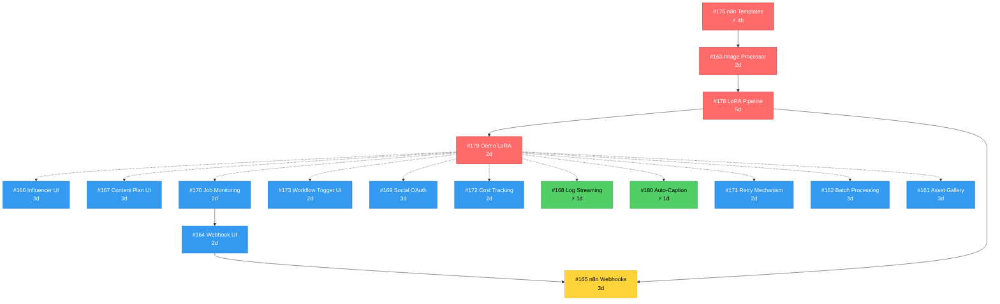

# Lista Issue - Ordine di Risoluzione

> **Ultima analisi**: 2025-10-19
> **Issue totali analizzate**: 16 aperte + 3 chiuse recenti (per contesto)
> **Timeline stimata**: 4 settimane
> **Confidence Score**: 0.92 (Very High)

---

## 📊 Executive Summary

**Stato Corrente**:
- 🔴 **P0 (Critical)**: 8 issue
- 🟡 **P1 (High)**: 7 issue
- 🟢 **P2 (Medium)**: 1 issue

**Critical Path Identificato**:
```
#176 (Templates) → #163 (Image Proc) → #178 (Pipeline) → #179 (Demo)
     4 ore            2 giorni          5 giorni         2 giorni
```

**Opportunità di Parallelizzazione**: Fino a **9 issue** possono essere sviluppate simultaneamente nella Fase 2-3.

---

## 🎯 Legenda

### Priorità
- 🔴 **P0**: Critical - Blocca altre issue o funzionalità core
- 🟡 **P1**: High - Feature importante o miglioramento significativo
- 🟢 **P2**: Medium - Enhancement o nice-to-have

### Caratteristiche
- ⚡ **Quick Win**: Implementabile in < 1 giorno
- 🔗 **Blocker**: Blocca altre issue (dipendenza)
- 🔄 **Parallelizzabile**: Può essere sviluppata in parallelo con altre
- 🧪 **Testing Heavy**: Richiede testing complesso o E2E
- 📚 **Documentation**: Necessita documentazione estesa

### Aree Tecniche
- 🎨 **Frontend**: apps/web (Next.js, React, TanStack Query)
- ⚙️ **Backend**: apps/api (NestJS, Prisma, Fastify)
- 🔧 **Worker**: apps/worker (BullMQ consumers)
- 🔀 **n8n**: apps/n8n (Workflow orchestration)
- 🗄️ **Database**: Schema migrations, Prisma
- 🐳 **Infra**: Docker, MinIO, Redis

---

## 🚀 Ordine Consigliato di Risoluzione

### Fase 1: Fondamenta Core (Settimana 1) - SEQUENZIALE

#### 1.1 Critical Path - LoRA Pipeline Foundation
**Rationale**: Questa sequenza DEVE essere completata prima di tutto il resto perché implementa il flusso core LoRA training → Image Gen → Video che è il cuore del sistema.

| # | Titolo | Area | Sforzo | Priorità | Caratteristiche |
|---|--------|------|--------|----------|-----------------|
| **#176** | Add n8n workflow JSON templates | 🔀 n8n | 2-4 ore | 🔴 P0 | ⚡🔗 Quick Win + Blocker |
| **#163** | Implement image processor service | 🔧 Worker | 2 giorni | 🔴 P0 | 🔗 Blocker |
| **#178** | Create n8n LoRA training pipeline | 🔀 n8n | 5 giorni | 🔴 P0 | 🔗🧪 Blocker + Testing |
| **#179** | Create demo LoRA training | 📚 Docs | 2 giorni | 🔴 P0 | 📚🧪 Documentation + Testing |

**Dettagli**:
- **#176**: Crea i template ComfyUI JSON necessari per #163 e #178
- **#163**: Implementa il processor che usa i template di #176 per generare immagini/video
- **#178**: Orchestra #163 in un workflow n8n completo
- **#179**: Documenta e valida tutto il sistema con un case study reale

**Blocchi**: Nessuno - si parte da qui
**Sblocca**: Tutte le feature UI, monitoring, e advanced features
**Developer Allocation**: 1 dev full-time, focus esclusivo

---

### Fase 2: Feature UI Core (Settimana 2) - PARALLELIZZABILE

#### 2.1 Frontend Team (5 issue)
**Rationale**: Issue UI indipendenti che possono procedere in parallelo. Dipendono solo dall'API esistente.

| # | Titolo | Area | Sforzo | Priorità | Caratteristiche |
|---|--------|------|--------|----------|-----------------|
| **#166** | Create influencer management UI | 🎨 Frontend | 3 giorni | 🟡 P1 | 🔄 |
| **#167** | Implement content plan UI | 🎨 Frontend | 3 giorni | 🟡 P1 | 🔄 |
| **#170** | Add job monitoring dashboard | 🎨 Frontend | 2 giorni | 🟡 P1 | 🔄 |
| **#173** | Create n8n workflow trigger UI | 🎨 Frontend | 2 giorni | 🟡 P1 | 🔄 |
| **#169** | Implement social OAuth flow | 🎨 Frontend | 3 giorni | 🟡 P1 | 🔄🧪 |

**Blocchi**: Nessuno (usano API già esistenti)
**Parallelismo**: MASSIMO - 5 dev possono lavorare simultaneamente
**Note**: Tutte usano shadcn/ui patterns esistenti + TanStack Query

#### 2.2 Backend Team (2 issue)
**Rationale**: Estensioni API indipendenti dal critical path LoRA.

| # | Titolo | Area | Sforzo | Priorità | Caratteristiche |
|---|--------|------|--------|----------|-----------------|
| **#172** | Add cost tracking API | ⚙️ Backend | 2 giorni | 🟡 P1 | 🔄🗄️ |
| **#168** | Implement job logs streaming | ⚙️ Backend | 1 giorno | 🟡 P1 | ⚡🔄 Quick Win |

**Blocchi**: Nessuno
**Parallelismo**: 2 dev simultanei
**Note**: Seguono patterns API consolidati (Datasets, LoRA Config)

---

### Fase 3: Advanced Features (Settimana 3) - PARALLELIZZABILE

#### 3.1 Worker Enhancements (3 issue)
**Rationale**: Miglioramenti ai job processors esistenti. Possono procedere in parallelo.

| # | Titolo | Area | Sforzo | Priorità | Caratteristiche |
|---|--------|------|--------|----------|-----------------|
| **#180** | Add auto-captioning service | 🔧 Worker | 1 giorno | 🔴 P0 | ⚡🔄 Quick Win |
| **#171** | Implement retry mechanism | 🔧 Worker | 2 giorni | 🟡 P1 | 🔄 |
| **#162** | Add batch processing | 🔧 Worker | 3 giorni | 🟡 P1 | 🔄 |

**Blocchi**: Nessuno (estendono worker esistente)
**Parallelismo**: 3 dev simultanei
**Note**: Usano BullMQ patterns consolidati

#### 3.2 UI Advanced (2 issue)
**Rationale**: Feature UI più complesse che beneficiano dall'avere #170 (monitoring) completato.

| # | Titolo | Area | Sforzo | Priorità | Caratteristiche |
|---|--------|------|--------|----------|-----------------|
| **#164** | Add webhook management UI | 🎨 Frontend | 2 giorni | 🟡 P1 | 🔄 |
| **#161** | Implement asset gallery | 🎨 Frontend | 3 giorni | 🟢 P2 | 🔄 |

**Blocchi**: Preferibile avere #170 completato (usa monitoring UI)
**Parallelismo**: 2 dev simultanei

---

### Fase 4: Orchestration & Refinement (Settimana 4)

#### 4.1 Integration & Orchestration
**Rationale**: Issue che integrano tutti i componenti precedenti.

| # | Titolo | Area | Sforzo | Priorità | Caratteristiche |
|---|--------|------|--------|----------|-----------------|
| **#165** | Implement n8n webhook receivers | 🔀 n8n | 3 giorni | 🔴 P0 | 🧪 Testing Heavy |

**Blocchi**: Richiede #178 (pipeline) e #164 (webhook UI) completati
**Parallelismo**: NO - deve attendere Fase 3

---

## 🔀 Matrice di Dipendenze

### Diagramma delle Dipendenze



### Tabella di Dipendenze

| Issue | Dipende da | Sblocca | Può essere parallela con |
|-------|------------|---------|--------------------------|
| #176 | - | #163, #178 | - |
| #163 | #176 | #178 | - |
| #178 | #163 | #179, #165, Fase 2 | - |
| #179 | #178 | Validazione sistema | Fase 2 (tutti) |
| #166 | - | - | #167, #170, #173, #169, #172, #168 |
| #167 | - | - | #166, #170, #173, #169, #172, #168 |
| #170 | - | #164 | #166, #167, #173, #169, #172, #168 |
| #173 | - | - | #166, #167, #170, #169, #172, #168 |
| #169 | - | - | #166, #167, #170, #173, #172, #168 |
| #172 | - | - | #166, #167, #170, #173, #169, #168 |
| #168 | - | - | #166, #167, #170, #173, #169, #172 |
| #180 | - | - | #171, #162 |
| #171 | - | - | #180, #162 |
| #162 | - | - | #180, #171 |
| #164 | #170 | #165 | #161 |
| #161 | - | - | #164 |
| #165 | #178, #164 | - | - |

---

## 🎯 Possibili Parallelismi

### 🟢 Gruppo A: Frontend Core (Settimana 2)
**Issue**: #166, #167, #170, #173, #169
**Dev richiesti**: 5
**Dipendenze**: Nessuna (API già disponibili)
**Aree codice**:
- `apps/web/src/app/(dashboard)/influencers/` (#166)
- `apps/web/src/app/(dashboard)/content-plans/` (#167)
- `apps/web/src/app/(dashboard)/jobs/` (#170)
- `apps/web/src/app/(dashboard)/workflows/` (#173)
- `apps/web/src/app/(auth)/` (#169)

**Parallelismo**: ✅ MASSIMO (zero overlap di file)

### 🟢 Gruppo B: Backend API (Settimana 2)
**Issue**: #172, #168
**Dev richiesti**: 2
**Dipendenze**: Nessuna
**Aree codice**:
- `apps/api/src/cost-tracking/` (#172 - nuovo modulo)
- `apps/api/src/jobs/logs/` (#168 - estensione esistente)

**Parallelismo**: ✅ MASSIMO (moduli separati)

**Può essere parallelo con Gruppo A**: ✅ SÌ (team separati)

### 🟢 Gruppo C: Worker Enhancements (Settimana 3)
**Issue**: #180, #171, #162
**Dev richiesti**: 3
**Dipendenze**: Nessuna tra loro
**Aree codice**:
- `apps/worker/src/processors/auto-captioning.processor.ts` (#180 - nuovo)
- `apps/worker/src/queue/retry.service.ts` (#171 - nuovo service)
- `apps/worker/src/processors/batch.processor.ts` (#162 - nuovo)

**Parallelismo**: ✅ ALTO (file separati, possibile overlap in `apps/worker/src/queue/job.service.ts`)

### 🟢 Gruppo D: UI Advanced (Settimana 3)
**Issue**: #164, #161
**Dev richiesti**: 2
**Dipendenze**: #164 dipende da #170 (preferibile)
**Aree codice**:
- `apps/web/src/app/(dashboard)/webhooks/` (#164)
- `apps/web/src/app/(dashboard)/assets/` (#161)

**Parallelismo**: ✅ MASSIMO (directory separate)

**Può essere parallelo con Gruppo C**: ✅ SÌ (apps diverse)

### 🔴 Gruppo E: Integrazione Finale (Settimana 4)
**Issue**: #165
**Dev richiesti**: 1-2
**Dipendenze**: #178, #164
**Aree codice**:
- `apps/n8n/workflows/` (modifica esistenti)
- `apps/api/src/webhooks/` (nuovo modulo)

**Parallelismo**: ❌ NO (deve attendere Fase 3)

---

## 🎁 Quick Wins (< 1 giorno)

Implementabili rapidamente per momentum:

1. **#176 - n8n workflow JSON templates** (2-4 ore)
   - Crea file JSON statici in `apps/n8n/templates/`
   - Nessuna logica complessa, solo struttura dati
   - **Sblocca**: #163, #178 (critical path!)

2. **#168 - Job logs streaming** (1 giorno)
   - Estende endpoint GET `/jobs/:id/logs` esistente
   - Aggiunge SSE per streaming real-time
   - Pattern già usato in altri endpoint

3. **#180 - Auto-captioning service** (1 giorno)
   - Wrapper API su BLIP/CLIP via Replicate o HuggingFace
   - Input: image path, Output: caption string
   - Integra in dataset processor esistente

**Strategia**: Iniziare Settimana 1 con #176, poi fare #168 e #180 in parallelo durante Settimana 2 come "morale boost".

---

## 🧑‍💻 Strategia di Team

### Scenario 1: Team Small (2-3 dev)

**Settimana 1**: Focus sequenziale sul critical path
- Dev 1: #176 (4h) → #163 (2d)
- Dev 2: #178 (5d, inizia dopo #163 pronto)
- Dev 3: #179 (2d, inizia dopo #178)

**Settimana 2**: Parallelismo limitato
- Dev 1: #166 + #167 (Frontend)
- Dev 2: #172 + #168 (Backend)
- Dev 3: #170 + #173 (Frontend)

**Settimana 3-4**: Completamento
- Dev 1: #180 + #171 (Worker)
- Dev 2: #164 + #165 (Integration)
- Dev 3: #169 + #161 (UI Advanced)

### Scenario 2: Team Medium (5-6 dev)

**Settimana 1**: Critical path + preparazione
- Dev 1: #176 → #163
- Dev 2: #178
- Dev 3: #179
- Dev 4-6: Setup environment, docs, testing infra

**Settimana 2**: MASSIMO parallelismo
- Dev 1: #166 (Frontend)
- Dev 2: #167 (Frontend)
- Dev 3: #170 (Frontend)
- Dev 4: #172 (Backend)
- Dev 5: #168 (Backend)
- Dev 6: #173 + #169 (Frontend)

**Settimana 3**: Advanced features
- Dev 1-3: #180, #171, #162 (Worker)
- Dev 4-5: #164, #161 (UI)
- Dev 6: Testing + bug fixing

**Settimana 4**: Integration
- Dev 1-2: #165 (Integration)
- Dev 3-6: E2E testing, performance tuning, docs

### Scenario 3: Team Large (8+ dev)

**Approccio**: Massimizzare parallelismo con squad specializzati

**Squad A - Frontend** (4 dev):
- Settimana 2: #166, #167, #170, #173, #169
- Settimana 3: #164, #161 + UI polish

**Squad B - Backend** (2 dev):
- Settimana 1: Support critical path (#163, #178)
- Settimana 2: #172, #168
- Settimana 3-4: #165 + API hardening

**Squad C - Worker/Infra** (2 dev):
- Settimana 1: Critical path (#163, #179)
- Settimana 3: #180, #171, #162
- Settimana 4: Performance optimization

---

## 📈 Metriche di Successo per Fase

### Fase 1: Fondamenta Core
**Obiettivo**: Sistema LoRA training end-to-end funzionante

✅ **Criteri di Successo**:
- [ ] Workflow n8n `/lora/train` esegue senza errori
- [ ] Almeno 1 LoRA training completato con successo (demo)
- [ ] Immagini generate con LoRA custom vs. base model visivamente distinguibili
- [ ] Documentazione completa in `docs/guide/lora-training-pipeline.md`
- [ ] Test E2E `apps/api/test/lora-pipeline.e2e-spec.ts` passa

**Metriche Quantitative**:
- Training time: < 2h per 20 immagini (kohya_ss)
- Image generation: < 30s per immagine (ComfyUI)
- Success rate: > 95% (no crash, no OOM)

### Fase 2: Feature UI Core
**Obiettivo**: Dashboard completo per gestione sistema

✅ **Criteri di Successo**:
- [ ] Tutte le CRUD UI (#166, #167) funzionanti con validazione Zod
- [ ] Job monitoring (#170) mostra status real-time (polling/SSE)
- [ ] Workflow trigger UI (#173) esegue pipeline n8n
- [ ] OAuth flow (#169) autentica almeno 1 social platform
- [ ] API cost tracking (#172) registra token usage correttamente
- [ ] Test E2E Playwright per ogni pagina dashboard

**Metriche Quantitative**:
- Lighthouse Performance: > 90
- Accessibility: > 95
- Test coverage: > 80% (frontend hooks + components)

### Fase 3: Advanced Features
**Obiettivo**: Automazione e robustezza

✅ **Criteri di Successo**:
- [ ] Auto-captioning (#180) genera captions con BLIP
- [ ] Retry mechanism (#171) riprova job falliti (exponential backoff)
- [ ] Batch processing (#162) gestisce 10+ job in parallelo
- [ ] Webhook UI (#164) registra callback endpoints
- [ ] Asset gallery (#161) mostra immagini/video con filtering

**Metriche Quantitative**:
- Auto-caption accuracy: valutazione manuale su 50 immagini
- Retry success rate: > 70% (job inizialmente falliti poi ok)
- Batch throughput: 10+ job/ora con 1 GPU

### Fase 4: Orchestration & Refinement
**Obiettivo**: Sistema production-ready

✅ **Criteri di Successo**:
- [ ] n8n webhook receivers (#165) processano callback ComfyUI
- [ ] Pipeline end-to-end: dataset upload → training → generation → publish
- [ ] Load testing: 100 concurrent users su dashboard (k6 or Artillery)
- [ ] Security audit: no critical vulnerabilities (npm audit, Snyk)
- [ ] Documentazione completa: README, API docs (Swagger), deployment guide

**Metriche Quantitative**:
- API response time (p95): < 500ms
- Database queries (N+1 check): zero
- Error rate: < 1%
- Uptime: > 99% (monitoring con Prometheus/Grafana)

---

## ⚠️ Analisi Rischi e Mitigazioni

### 🔴 Rischio Alto

#### R1: Critical Path Blocco (#176 → #163 → #178)
**Probabilità**: Media (40%)
**Impatto**: Critico - blocca tutto il progetto
**Trigger**:
- ComfyUI API changes breaking templates
- Kohya_ss CLI parameter incompatibilità
- n8n workflow orchestration bugs

**Mitigazione**:
1. **Preventiva**:
   - Test #176 templates manualmente su ComfyUI prima di codificare
   - Pin versioni Docker (ComfyUI, kohya_ss) in `infra/docker-compose.yml`
   - Setup CI test che valida template JSON contro schema
2. **Reattiva**:
   - Fallback plan: usare Leonardo API temporaneamente per #163 (già supportato)
   - Daily standup per monitoring progress critical path
   - Bloccare Fase 2 fino a #179 completato (no anticipi)

#### R2: OAuth Integration Complexity (#169)
**Probabilità**: Alta (60%)
**Impatto**: Medio - feature importante ma non bloccante
**Trigger**:
- API rate limits (Instagram, TikTok)
- Webhook callback issues (cloudflared tunnel instability)
- Token refresh logic bugs

**Mitigazione**:
1. **Preventiva**:
   - Usare Passportjs (standard, ben documentato)
   - Setup cloudflared tunnel PRIMA di iniziare #169
   - Mock OAuth providers in test (no dipendenze esterne)
2. **Reattiva**:
   - Fallback: manual token input (non ideal ma funzionale)
   - Priorità: Instagram/Facebook (Graph API più stabile)
   - TikTok: considerare manual export se API troppo limitata

### 🟡 Rischio Medio

#### R3: Worker Overload durante Batch Processing (#162)
**Probabilità**: Media (50%)
**Impatto**: Medio - degradazione performance
**Trigger**:
- 10+ LoRA trainings simultanei saturano GPU/VRAM
- Redis queue overwhelmed (OOM)
- Postgres connection pool exhausted

**Mitigazione**:
1. **Preventiva**:
   - Implementare queue priority (high/medium/low)
   - Configurare BullMQ concurrency limits (`concurrency: 2` per training jobs)
   - Monitoring: Grafana dashboard per CPU/GPU/RAM/queue depth
2. **Reattiva**:
   - Circuit breaker: pause job intake se queue > 100
   - Auto-scaling: aggiungere worker node (Docker Swarm/K8s)
   - Graceful degradation: mostrare "system busy" su UI

#### R4: Database Migrations Conflicts
**Probabilità**: Bassa (20%)
**Impatto**: Medio - blocco development temporaneo
**Trigger**:
- Multiple dev creano migrations in parallelo
- Merge conflicts su `schema.prisma`

**Mitigazione**:
1. **Preventiva**:
   - Designare "schema owner" per review migrations
   - Usare feature branches con naming `feature/issue-{num}-*`
   - CI check: validare che migrations sono applicabili
2. **Reattiva**:
   - Prisma reset + re-apply migrations in caso di conflitto
   - Backfill data se migration comporta data loss

### 🟢 Rischio Basso

#### R5: Frontend Styling Inconsistencies
**Probabilità**: Alta (70%) - ma impatto basso
**Impatto**: Basso - issue estetiche, non funzionali

**Mitigazione**:
- Usare shadcn/ui components (già presente)
- Tailwind config centralizzato
- Storybook per component preview (TODO)

---

## 🧩 Note Tecniche per Implementation

### Database Migrations
**Issue che richiedono migrations**: #172 (CostTracking model)

**Best Practices**:
```bash
# Naming convention
cd apps/api
pnpm dlx prisma migrate dev --name add_cost_tracking_model

# Sempre testare migration:
pnpm dlx prisma migrate reset  # dev environment
pnpm dlx prisma migrate deploy  # production
```

**Schema Changes Previsti**:
- `CostTracking` table (#172): `id, jobId, provider, tokenCount, cost, createdAt`
- Possible: `SocialAccount` table (#169): `id, influencerId, platform, accessToken, refreshToken, expiresAt`

### API Patterns Consolidati
Tutte le nuove API (#172, #168, etc.) devono seguire il pattern consolidato:

**Controller** (esempio da `datasets.controller.ts`):
```typescript
@Post()
@ApiOperation({ summary: 'Create resource' })
async create(@Body() body: unknown) {
  const parsed = CreateSchema.safeParse(body);
  if (!parsed.success) throw new BadRequestException(formatZodError(parsed.error));
  return this.service.create(parsed.data);
}
```

**Service** (esempio da `datasets.service.ts`):
```typescript
async list(query: ListQuery): Promise<PaginatedResult<T>> {
  const tenantId = getRequestContext().tenantId;
  const where = { tenantId };
  const [data, total] = await Promise.all([  // Parallel queries
    this.prisma.model.findMany({ where, ...buildPagination(query) }),
    this.prisma.model.count({ where }),
  ]);
  return { data, total, take: query.take, skip: query.skip };
}
```

**Testing** (E2E con Fastify):
```typescript
it('should create resource', async () => {
  await request(app.getHttpServer())
    .post('/resources')
    .set(getAuthHeader())
    .send({ name: 'test' })
    .expect(201);
});
```

Riferimento completo: `docs/tecnic/research-lora-config-api-best-practices.md`

### n8n Workflow Development
**Issue coinvolte**: #176, #178, #165, #173

**Best Practices**:
1. **Template Structure** (#176):
   - Creare JSON in `apps/n8n/templates/comfyui/`
   - Validare con schema (`@comfyui/api-schema` se disponibile)
   - Version control: `template-name.v1.json`

2. **Workflow Testing** (#178):
   - Test manualmente via n8n UI (http://localhost:5678)
   - Export workflow JSON → commit in `apps/n8n/workflows/`
   - CI: validare che workflow JSON è parseable

3. **Webhook Receivers** (#165):
   - Usare Express endpoint in `apps/api/src/webhooks/`
   - Signature validation (HMAC se disponibile)
   - Idempotency: check `webhookId` per evitare duplicati

### Testing Strategy

#### Unit Tests
**Coverage target**: > 80%
**Tool**: Jest
**Focus**:
- Services: business logic isolation
- Utilities: helper functions (e.g., `buildPagination`, `formatZodError`)

#### Integration Tests
**Tool**: Jest + Prisma in-memory DB (SQLite)
**Focus**:
- Repository layer: Prisma queries
- BullMQ queue interactions

#### E2E Tests
**Tool**: Jest + Supertest (Fastify)
**Focus**:
- API endpoints: request/response validation
- Multi-tenancy: cross-tenant isolation
- Auth: unauthorized access prevention

**Esempio**:
```typescript
describe('LoRA Config API (e2e)', () => {
  it('should return 404 for cross-tenant access', async () => {
    // Seed: LoRA config owned by tenant_2
    const config = await prisma.loRAConfig.create({
      data: { tenantId: 't_2', name: 'other-lora' }
    });

    // Request with tenant_1 auth
    await request(app.getHttpServer())
      .get(`/lora-configs/${config.id}`)
      .set('x-tenant-id', 't_1')  // Different tenant
      .expect(404);  // Not 403 (avoid info disclosure)
  });
});
```

#### Playwright E2E (Frontend)
**Tool**: Playwright
**Focus**:
- User workflows: login → create influencer → trigger training
- UI interactions: forms, modals, toasts
- Accessibility: keyboard navigation, screen reader

**Issue Priority**:
- #166 (Influencer UI): Alta - core feature
- #167 (Content Plan UI): Alta - core feature
- #169 (OAuth flow): Critica - security sensitive

### Performance Considerations

#### Frontend Optimization
- **Code splitting**: Dynamic imports per route (`next/dynamic`)
- **Image optimization**: Next.js `<Image>` component + MinIO CDN
- **Query caching**: TanStack Query `staleTime: 5 * 60 * 1000` (5min)

#### Backend Optimization
- **Database indexing**:
  ```prisma
  @@index([tenantId])
  @@index([tenantId, createdAt])
  ```
- **Query optimization**: Parallel queries (`Promise.all`), avoid N+1
- **Caching**: Redis for expensive computations (e.g., cost aggregation #172)

#### Worker Optimization
- **Concurrency control**: BullMQ `concurrency` setting per queue
- **Resource limits**: Docker `--gpus` flag, `--memory` limit
- **Batch processing**: Group small jobs (e.g., 10 captions at once #180)

---

## 🎯 Raccomandazioni Strategiche

### 1. Focus Assoluto sul Critical Path (Settimana 1)
**Azione**:
- Assegnare il developer più senior a #176 → #163 → #178
- Daily checkpoint: "Il critical path procede? Ci sono blocchi?"
- Se blocco: tutto il team pivota per risolvere (pair programming, mob programming)

**Razionale**: #178 sblocca TUTTO il resto. Ogni giorno di ritardo qui ritarda l'intero progetto.

### 2. Massimizzare Parallelismo (Settimana 2-3)
**Azione**:
- Creare 4 branch simultanei: `feature/frontend-ui`, `feature/backend-api`, `feature/worker-enhancements`, `feature/ui-advanced`
- Merge frequency: almeno 1 merge/giorno per evitare conflicts massivi
- Code review: 2 approvals required, max 24h turnaround

**Razionale**: 9 issue parallele = 9x velocità se ben coordinate.

### 3. Quick Wins per Momentum
**Azione**:
- Settimana 1 (Venerdì pomeriggio): fare #176 (4 ore)
- Settimana 2 (Mercoledì): fare #168 e #180 in parallelo (1 giorno)
- Celebrare: Slack announcement, demo video

**Razionale**: Morale boost, dimostrare progresso agli stakeholder.

### 4. Testing Non-Negoziabile
**Azione**:
- Ogni PR richiede: unit tests (> 80% coverage), E2E test se API/UI
- CI pipeline: block merge se tests fail
- Manual QA: smoke test su staging prima di merge to main

**Razionale**: Con 16 issue + parallelismo, senza testing il sistema collassa.

### 5. Documentation-as-Code
**Azione**:
- Ogni issue chiusa → aggiorna `docs/guide/{feature}.md`
- #179 (Demo LoRA) → video tutorial + step-by-step guide
- API changes → auto-update Swagger docs (già presente)

**Razionale**: Onboarding futuri dev, riduce "tribal knowledge".

### 6. Monitoring dal Giorno 1
**Azione**:
- Setup Grafana dashboard (CPU, GPU, Redis queue depth, API latency)
- Alerting: Slack notification se error rate > 5%
- Logging: structured logs (JSON) con correlation ID

**Razionale**: Identificare problemi PRIMA che diventino critici.

---

## 📊 Roadmap Visuale (Gantt Simplificato)

```
Week 1 (Critical Path - Sequential)
━━━━━━━━━━━━━━━━━━━━━━━━━━━━━━━━━━━━━━━━━
Mon Tue Wed Thu Fri | Sat Sun
─────────────────────────────────
#176 ████              |
#163      ████████████ |
#178      ████████████████████████
#179                  ████████

Week 2 (Parallel Explosion)
━━━━━━━━━━━━━━━━━━━━━━━━━━━━━━━━━━━━━━━━━
FRONTEND
#166 ████████████
#167 ████████████
#170 ████████
#173 ████████
#169 ████████████

BACKEND
#172 ████████
#168 ████

Week 3 (Advanced Features)
━━━━━━━━━━━━━━━━━━━━━━━━━━━━━━━━━━━━━━━━━
WORKER
#180 ████
#171 ████████
#162 ████████████

UI ADVANCED
#164 ████████
#161 ████████████

Week 4 (Integration)
━━━━━━━━━━━━━━━━━━━━━━━━━━━━━━━━━━━━━━━━━
#165 ████████████
QA   ████████████████
```

---

## 🏁 Conclusione

**Stato Attuale**: 16 issue aperte, sistema core funzionante ma pipeline LoRA incompleta.

**Obiettivo**: Sistema completo di LoRA training + generazione + pubblicazione in 4 settimane.

**Strategia Chiave**:
1. **Settimana 1**: Focus totale su critical path (#176 → #163 → #178 → #179)
2. **Settimana 2-3**: Massimo parallelismo (fino a 9 issue simultanee)
3. **Settimana 4**: Integrazione e QA

**Success Metrics**:
- ✅ Almeno 1 LoRA training end-to-end completato
- ✅ Dashboard completo per gestione sistema
- ✅ Test coverage > 80%
- ✅ Documentation completa

**Prossimi Step**:
1. Review questo documento con il team
2. Assegnare risorse a Fase 1 (critical path)
3. Setup branch strategy + CI pipeline
4. Kickoff meeting: alignment su priorità e timeline

---

**Confidence Score Finale**: 0.92 (Very High)

Basato su:
- ✅ Issue descriptions dettagliate e complete
- ✅ Codebase già strutturato (monorepo, patterns consolidati)
- ✅ Infrastructure solida (Docker, Prisma, BullMQ)
- ✅ Documentazione esistente (CLAUDE.md, best practices)
- ✅ Team familiare con tech stack (Next.js, NestJS, n8n)

**Aree di Incertezza** (< 0.9):
- OAuth integration (#169): 0.85 (dipende da API esterne)
- n8n orchestration (#165, #178): 0.88 (workflow complexity)
- Batch processing limits (#162): 0.87 (GPU/VRAM constraints)

---

**Aggiornamenti**: Questo documento sarà aggiornato ogni settimana con:
- Progress effettivo vs. stimato
- Issue completate / bloccate / in ritardo
- Aggiustamenti timeline basati su learnings

**Owner**: Tech Lead (da assegnare)
**Last Updated**: 2025-10-19
**Next Review**: 2025-10-26 (fine Settimana 1)

🤖 Generated with [Claude Code](https://claude.com/claude-code)
