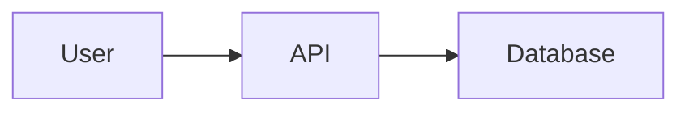

# Documentazione InfluencerAI

Benvenuto nella documentazione completa del sistema InfluencerAI - piattaforma per la generazione automatizzata di contenuti per influencer virtuali.

---

## 🚀 Inizio Rapido

**Nuovo nel progetto?** Inizia qui:

1. **[Avvio Rapido (5 minuti)](./getting-started/avvio-rapido.md)** - Setup Docker e primi passi
2. **[Panoramica Architettura](./architecture/panoramica.md)** - Comprendi il sistema
3. **[API Best Practices](/CLAUDE.md#api-development-best-practices)** - Pattern di sviluppo

---

## 📚 Documentazione per Categoria

### Getting Started

Perfetto per iniziare a sviluppare:

- **[Avvio Rapido](./getting-started/avvio-rapido.md)** - Setup con Docker in 5 minuti
- **[Setup Sviluppo Locale](./getting-started/sviluppo-locale.md)** - Setup completo senza Docker
- **[Variabili d'Ambiente](./getting-started/variabili-ambiente.md)** - Riferimento `.env` completo
- **[Risoluzione Problemi](./getting-started/risoluzione-problemi.md)** - Soluzioni ai problemi comuni

**Tempo stimato setup**: 5-15 minuti

---

### Architettura

Comprendi il design del sistema:

- **[Panoramica Architettura](./architecture/panoramica.md)** ⭐ - Diagramma sistema, componenti, tech stack
- **[Flusso Dati](./architecture/flusso-dati.md)** - Lifecycle richieste, pattern elaborazione
- **[Deployment](./architecture/deployment.md)** - Docker Compose, infrastruttura, scaling
- **[ComfyUI Workflow Templates](./architecture/comfyui-workflow-templates-architecture.md)** - Design templates JSON per generazione immagini
- **[ComfyUI Templates Summary](./architecture/comfyui-workflow-templates-summary.md)** - Quick reference architettura templates

**Per chi**: Nuovi developer, architetti, chi vuole capire il big picture

---

### Sviluppo API

Best practices per sviluppare API backend:

- **[API Development Guide](/CLAUDE.md#api-development-best-practices)** ⭐ - Pattern NestJS, Prisma, Zod
- **[Technical Research - LoRA Config API](./tecnic/research-lora-config-api-best-practices.md)** - Esempio completo implementazione
- **[NestJS GET Endpoints](./tecnic/nestjs-get-endpoints-best-practices.md)** - Pattern paginazione e filtering
- **[API Quick Reference](./tecnic/api-development-quick-reference.md)** - Cheatsheet rapido

**Esempi Codice**: Tutti i pattern includono esempi verificati copy-paste ready

---

### n8n Workflow Orchestration

Patterns e best practices per workflow automation:

- **[n8n Multi-Stage Pipeline Research](./tecnic/research-n8n-multi-stage-pipeline-orchestration.md)** ⭐ - Deep research su orchestrazione complessa
- **[n8n Workflows Guide](../apps/n8n/README.md)** - Setup, testing, workflow esistenti
- **[n8n Implementation Details](../apps/n8n/IMPLEMENTATION.md)** - Dettagli implementazione tecnica

**Focus**: Long-running jobs, error handling, state management, notifications

---

### Testing

Strategie di test e QA:

- **[Testing Guide](./TESTING.md)** - Unit, integration, E2E testing
- **[BDD Specifications](./bdd/)** - Feature specs Behavior-Driven Development

**Coverage Target**: >80% per service layer, >60% overall

---

### Feature Documentation

Guide specifiche per funzionalità:

#### Dataset Management
- **[Dataset UI Research](./tecnic/research-dataset-ui-nextjs-tanstack-query.md)** - Frontend implementation
- **[BDD: Dataset GET Endpoints](./bdd/feature-174-dataset-get-endpoints.md)** - Specification

#### LoRA Training
- **[Getting Started Guide](./guide/training/GETTING-STARTED.md)** ⭐ - Complete training workflow (0 to trained LoRA in 30 min)
- **[API Reference](./guide/training/API-REFERENCE.md)** - Programmatic training with cURL and TypeScript examples
- **[Dataset Structure Guide](./guide/training/examples/datasets.md)** - How to organize and prepare training datasets
- **[Troubleshooting](./guide/training/TROUBLESHOOTING.md)** - Common issues and solutions
- **[Example Dataset](./guide/training/examples/portrait-demo/)** - Demo dataset with captions

#### Content Generation
- **[ComfyUI Workflow Research](./tecnic/research-comfyui-workflow-templates.md)** - Research completo workflow JSON
- **[ComfyUI Quick Reference](./tecnic/comfyui-workflow-quick-reference.md)** - Cheatsheet nodes e patterns
- **[ComfyUI Templates Architecture](./architecture/comfyui-workflow-templates-architecture.md)** - Design templates sistema
- Pipeline completa generazione contenuti
- Workflow n8n

**Per chi**: Feature developers, product managers

---

### Apps Specifiche

Documentazione per singole applicazioni:

#### API Backend
- **[apps/api/README.md](../apps/api/README.md)** - Setup, endpoints, architecture
- Tecnologie: NestJS, Fastify, Prisma, Zod, BullMQ

#### Web Dashboard
- **[apps/web/README.dashboard.md](../apps/web/README.dashboard.md)** - UI components, routing
- **[apps/web/README.ui.md](../apps/web/README.ui.md)** - Component library
- Tecnologie: Next.js App Router, Tailwind, shadcn/ui, TanStack Query

#### Worker Service
- **[apps/worker/README.md](../apps/worker/README.md)** - Job processors, queue config
- Tecnologie: BullMQ consumers, ComfyUI integration

#### n8n Workflows
- **[apps/n8n/README.md](../apps/n8n/README.md)** ⭐ - Automazione completa
- **[apps/n8n/IMPLEMENTATION.md](../apps/n8n/IMPLEMENTATION.md)** - Dettagli implementazione
- **[apps/n8n/TESTING.md](../apps/n8n/TESTING.md)** - Testing workflows

---

### Security

Sicurezza e best practices:

- **[Token Rotation](./security/token-rotation.md)** - Gestione JWT e refresh tokens
- Multi-tenancy enforcement patterns
- Secrets management

---

### Spikes e Research

Investigazioni tecniche approfondite:

- **[Vitest 3 + Puppeteer 24 Migration](./spikes/VITEST3_PUPPETEER24_MIGRATION_SPIKE.md)**
- **[Zod v4 Migration](./spikes/ZOD_V4_MIGRATION_SPIKE.md)**

---

### Issue Resolution & Code Reviews

Documentazione storica issue risolte:

- **[Issue #175: LoRA Config API](./issue/issue-175-code-review.md)** - Code review completo
- **[Issue #175: DoD Validation](./issue/issue-175-dod-validation.md)** - Definition of Done checklist

**Pattern**: Ogni issue maggiore ha documento review + DoD validation

---

## 🗺️ Mappa Navigazione Rapida

```
Voglio...                                    → Vai a...
━━━━━━━━━━━━━━━━━━━━━━━━━━━━━━━━━━━━━━━━━━━━━━━━━━━━━━━━━━━━━━━━━━━━━
Setup ambiente sviluppo                     → getting-started/avvio-rapido.md
Capire architettura sistema                 → architecture/panoramica.md
Implementare nuovo endpoint API             → /CLAUDE.md + tecnic/api-*
Fare troubleshooting problema setup         → getting-started/risoluzione-problemi.md
Configurare variabili ambiente              → getting-started/variabili-ambiente.md
Capire flusso content generation            → architecture/flusso-dati.md
Configurare n8n workflow                    → apps/n8n/README.md
Implementare test E2E                       → TESTING.md
Vedere esempi codice verificati             → tecnic/research-lora-config-api-*
Deploy in produzione                        → architecture/deployment.md
Trainare LoRA personalizzato                → guide/training/GETTING-STARTED.md
Preparare dataset per training              → guide/training/examples/datasets.md
Usare API training programmaticamente       → guide/training/API-REFERENCE.md
Risolvere problemi training                 → guide/training/TROUBLESHOOTING.md
```

---

## 📊 Stato Progetto

**Versione**: Pre-MVP (Q4 2025)
**Ultimo aggiornamento docs**: 2025-10-18

### Completamento Features

| Area | Stato | Completamento |
|------|-------|---------------|
| **API Backend** | ✅ In produzione | 85% |
| **Database Schema** | ✅ Stabile | 95% |
| **Frontend Dashboard** | 🔄 In sviluppo | 40% |
| **Worker Processing** | 🔄 In sviluppo | 60% |
| **n8n Workflows** | 🔄 In test | 70% |
| **LoRA Training** | 🔄 In sviluppo | 50% |
| **Video Generation** | ⏳ Pianificato | 20% |
| **Social Autoposting** | ⏳ Pianificato | 10% |

**Legend**: ✅ Done | 🔄 In Progress | ⏳ Planned

Per dettagli aggiornati: [docs/stato-progetto.md](./stato-progetto.md)

---

## 🛠️ Stack Tecnologico

### Frontend
- **Framework**: Next.js 14 (App Router)
- **Styling**: Tailwind CSS + shadcn/ui
- **State**: TanStack Query (React Query)
- **Forms**: React Hook Form + Zod

### Backend
- **Framework**: NestJS 10 + Fastify
- **Database**: PostgreSQL 15 + Prisma ORM
- **Validation**: Zod schemas
- **Queue**: BullMQ (Redis)
- **Storage**: MinIO (S3-compatible)

### AI Services
- **Text Generation**: OpenRouter API (GPT-4, Claude)
- **Image Generation**: ComfyUI + Stable Diffusion (locale)
- **LoRA Training**: kohya_ss CLI (locale)
- **Video**: AnimateDiff/SVD via ComfyUI

### Orchestration
- **Workflows**: n8n
- **Containerization**: Docker + Docker Compose

---

## 📖 Convenzioni Documentazione

### Struttura File

```markdown
# Titolo Documento

Breve descrizione (1-2 frasi)

---

## Sezione 1

Contenuto...

## Sezione 2

Contenuto...

---

## Riferimenti

- [Link doc correlato](./altro.md)

---

**Ultimo aggiornamento**: YYYY-MM-DD
```

### Naming Convention

- **Guide**: `nome-guida.md` (lowercase, trattini)
- **App README**: `README.md` o `README.<topic>.md`
- **Specs**: `feature-<issue-number>-<nome>.md`
- **Research**: `research-<topic>-<subtopic>.md`

### Diagrammi

- **Tool**: Mermaid.js per diagrammi (rendering automatico GitHub/VS Code)
- **Tipi**: Sequence, flowchart, C4 architecture

**Esempio**:


---

## 🤝 Contribuire alla Documentazione

### When to Document

Documenta quando:
- ✅ Implementi nuova feature maggiore
- ✅ Risolvi issue complessa (>4 ore lavoro)
- ✅ Cambi architettura o pattern esistenti
- ✅ Aggiungi nuova dipendenza significativa

Non serve documentare:
- ❌ Fix typo o refactoring minori
- ❌ Update dipendenze patch version
- ❌ Modifiche self-explanatory dal codice

### Come Contribuire

1. **Branch per docs**: `docs/<topic>`
2. **Update esistenti**: Edit direttamente + commit
3. **Nuovi documenti**: Segui template + PR review

```bash
# Esempio workflow
git checkout -b docs/new-feature-guide
# Edit/create docs
git add docs/
git commit -m "docs: add guide for new feature X"
git push origin docs/new-feature-guide
# Open PR
```

### Review Checklist

- [ ] Markdown lint-free (no broken links)
- [ ] Code examples tested
- [ ] Screenshots attuali (se presenti)
- [ ] Links interni funzionanti
- [ ] "Ultimo aggiornamento" date corretta

---

## 📞 Supporto

### Dove Trovare Aiuto

1. **Questa documentazione** - Cerca prima qui
2. **[Risoluzione Problemi](./getting-started/risoluzione-problemi.md)** - Problemi comuni
3. **GitHub Issues** - Bug e feature request
4. **Slack/Discord** - Real-time support (se disponibile)

### Contatti

- **Tech Lead**: [link se disponibile]
- **DevOps**: [link se disponibile]
- **Documentation**: Tutti possono contribuire via PR

---

## 🗂️ Documentazione Storica

Documenti archiviati ma potenzialmente utili per contesto:

- **[Roadmap Originale](./historical/)** - Pianificazione iniziale 6 settimane
- **[Sprint Calendar](./historical/)** - Calendario day-by-day originale
- **[Issue Resolutions](./issue/)** - Summaries PR importanti

**Nota**: Questi documenti sono stati superati dallo sviluppo attuale ma sono conservati per riferimento storico.

---

## 🔗 Link Veloci

### External Resources

- **[OpenRouter API Docs](https://openrouter.ai/docs)** - LLM API documentation
- **[ComfyUI Wiki](https://github.com/comfyanonymous/ComfyUI/wiki)** - Image/video generation
- **[kohya_ss Docs](https://github.com/kohya-ss/sd-scripts)** - LoRA training
- **[n8n Docs](https://docs.n8n.io/)** - Workflow automation
- **[Prisma Docs](https://www.prisma.io/docs)** - ORM documentation
- **[NestJS Docs](https://docs.nestjs.com/)** - Backend framework

### Internal Tools

- **API Swagger**: http://localhost:3001/api/docs (dopo setup)
- **n8n UI**: http://localhost:5678 (user: admin, pass: admin123)
- **MinIO Console**: http://localhost:9001 (user: minio, pass: minio12345)
- **Prisma Studio**: `cd apps/api && pnpm dlx prisma studio`

---

## 📝 Feedback

Hai suggerimenti per migliorare questa documentazione?

- **GitHub Issue**: [Nuovo issue con label "documentation"]
- **Pull Request**: Contribuisci direttamente
- **Commenti**: Inline su documenti specifici

**Grazie per contribuire a mantenere la documentazione aggiornata e utile!**

---

**Mantenuto da**: Team InfluencerAI
**Ultimo aggiornamento globale**: 2025-10-18
**Prossimo review**: Mensile
