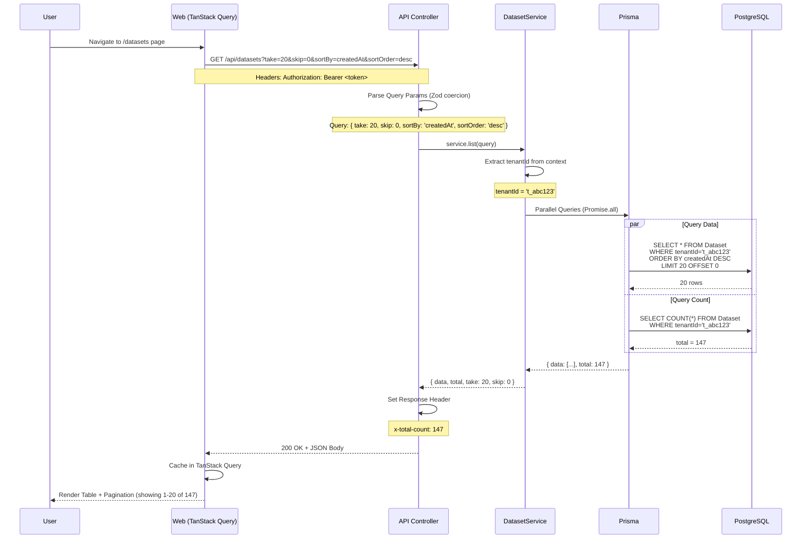

# Flusso Dati e Lifecycle Richieste

**Versione**: 1.0
**Data ultimo aggiornamento**: 2025-10-18

---

## Sommario

Questo documento descrive in dettaglio come i dati fluiscono attraverso il sistema InfluencerAI, dalla richiesta utente fino alla risposta finale. Copre tutti i principali use case e pattern di elaborazione.

---

## Indice

1. [Pattern Generali](#pattern-generali)
2. [Flusso CRUD Standard](#flusso-crud-standard)
3. [Flusso Content Generation](#flusso-content-generation)
4. [Flusso LoRA Training](#flusso-lora-training)
5. [Flusso Video Generation](#flusso-video-generation)
6. [Flusso n8n Orchestration](#flusso-n8n-orchestration)
7. [Gestione Errori e Retry](#gestione-errori-e-retry)
8. [Caching e Ottimizzazioni](#caching-e-ottimizzazioni)

---

## Pattern Generali

### Request Flow Standard


### Multi-Tenancy Enforcement

**Ogni richiesta passa attraverso questo flow**:

```typescript
// 1. JWT Middleware estrae tenantId
@UseGuards(JwtAuthGuard)
export class DatasetsController {
  // 2. Request context contiene tenantId
  async list() {
    const ctx = getRequestContext();
    const tenantId = ctx.tenantId; // 't_abc123'

    // 3. Service filtra sempre per tenantId
    return this.service.list({ tenantId });
  }
}

// 4. Prisma query include WHERE tenantId
async list(query: { tenantId: string }) {
  return this.prisma.dataset.findMany({
    where: { tenantId: query.tenantId }, // SEMPRE presente
    orderBy: { createdAt: 'desc' }
  });
}
```

**Sicurezza**: Non esiste modo per un tenant di accedere dati di un altro tenant.

---

## Flusso CRUD Standard

### GET /api/datasets (List con Paginazione)

**Caso d'uso**: Utente visualizza lista dataset nella dashboard



**Performance**: Query parallele riducono latenza del 50% (~100ms → ~50ms)

**Request**:
```http
GET /api/datasets?take=20&skip=0&sortBy=createdAt&sortOrder=desc HTTP/1.1
Host: localhost:3001
Authorization: Bearer eyJhbGc...
```

**Response**:
```http
HTTP/1.1 200 OK
Content-Type: application/json
x-total-count: 147

{
  "data": [
    {
      "id": "ds_001",
      "tenantId": "t_abc123",
      "name": "influencer-bella-portraits",
      "path": "data/datasets/influencer-bella-portraits",
      "imageCount": 87,
      "status": "ready",
      "createdAt": "2025-10-15T10:30:00Z",
      "updatedAt": "2025-10-16T14:20:00Z"
    },
    // ... altri 19 items
  ],
  "total": 147,
  "take": 20,
  "skip": 0
}
```

---

### GET /api/datasets/:id (Get by ID)

**Caso d'uso**: Utente clicca su dataset per vedere dettagli


**Pattern Sicurezza Difensiva**:
```typescript
async getById(id: string): Promise<Dataset> {
  const ctx = getRequestContext();
  const tenantId = ctx.tenantId;

  const dataset = await this.prisma.dataset.findUnique({ where: { id } });

  if (!dataset) {
    throw new NotFoundException(`Dataset ${id} not found`);
  }

  // Ritorna 404 invece di 403 per evitare information disclosure
  // (OWASP best practice: non rivelare esistenza risorse non autorizzate)
  if (dataset.tenantId !== tenantId) {
    throw new NotFoundException(`Dataset ${id} not found`);
  }

  return dataset;
}
```

---

### POST /api/datasets (Create)

**Caso d'uso**: Utente crea nuovo dataset


**Request**:
```http
POST /api/datasets HTTP/1.1
Content-Type: application/json
Authorization: Bearer eyJhbGc...

{
  "name": "influencer-marco-gym",
  "path": "data/datasets/influencer-marco-gym",
  "imageCount": 120,
  "metadata": {
    "captionStyle": "natural",
    "tags": ["fitness", "gym", "motivation"]
  }
}
```

**Response (Success)**:
```http
HTTP/1.1 201 Created
Location: /api/datasets/ds_new123
Content-Type: application/json

{
  "id": "ds_new123",
  "tenantId": "t_abc123",
  "name": "influencer-marco-gym",
  "path": "data/datasets/influencer-marco-gym",
  "imageCount": 120,
  "status": "draft",
  "metadata": { "captionStyle": "natural", "tags": [...] },
  "createdAt": "2025-10-18T16:05:00Z",
  "updatedAt": "2025-10-18T16:05:00Z"
}
```

**Response (Validation Error)**:
```http
HTTP/1.1 400 Bad Request
Content-Type: application/json

{
  "statusCode": 400,
  "message": "name: Name must be at least 3 characters; imageCount: must be positive integer",
  "error": "Bad Request"
}
```

---

## Flusso Content Generation

**Caso d'uso**: Genera immagine per post Instagram influencer

### Overview Completo


### Step-by-Step Dettagliato

#### Step 1: Creazione Job

**User Action**: Clicca "Genera Contenuto" nel dashboard

**Frontend**:
```typescript
// TanStack Query mutation
const { mutate } = useMutation({
  mutationFn: (payload) => fetch('/api/jobs', {
    method: 'POST',
    headers: { 'Content-Type': 'application/json' },
    body: JSON.stringify({
      type: 'content-generation',
      payload: {
        influencerId: 'inf_001',
        contentType: 'instagram-post',
        topic: 'morning workout routine',
        style: 'motivational'
      }
    })
  }),
  onSuccess: (data) => {
    // Redirect a job detail page con polling
    navigate(`/jobs/${data.jobId}`);
  }
});
```

**API Endpoint**:
```typescript
// apps/api/src/jobs/jobs.controller.ts
@Post()
async create(@Body() body: unknown) {
  const parsed = CreateJobSchema.safeParse(body);
  if (!parsed.success) {
    // ... validation error handling
  }

  const job = await this.jobsService.create(parsed.data);
  return job;
}
```

**Service Layer**:
```typescript
// apps/api/src/jobs/jobs.service.ts
async create(dto: CreateJobDto): Promise<Job> {
  const ctx = getRequestContext();
  const tenantId = ctx.tenantId;

  // 1. Create Job in database (status: pending)
  const job = await this.prisma.job.create({
    data: {
      id: cuid(),
      tenantId,
      type: dto.type,
      status: 'pending',
      payload: dto.payload,
      createdAt: new Date()
    }
  });

  // 2. Add to BullMQ queue
  await this.queueService.add(dto.type, {
    jobId: job.id,
    tenantId,
    payload: dto.payload
  });

  return job;
}
```

---

#### Step 2: Worker Consuma Job

**Worker Process**:
```typescript
// apps/worker/src/processors/content-generation.processor.ts
@Processor('content-generation')
export class ContentGenerationProcessor {
  @Process()
  async process(job: Bull.Job) {
    const { jobId, tenantId, payload } = job.data;

    try {
      // Update status to processing
      await this.updateJobStatus(jobId, 'processing');

      // Step 1: Generate content plan with OpenRouter
      const contentPlan = await this.generateContentPlan(payload);

      // Step 2: Generate SD prompt
      const sdPrompt = await this.generateSDPrompt(contentPlan);

      // Step 3: Generate image with ComfyUI
      const image = await this.generateImage(sdPrompt, payload);

      // Step 4: Upload to MinIO
      const s3Key = await this.uploadImage(image, tenantId, jobId);

      // Step 5: Create Asset record
      const asset = await this.createAsset(tenantId, jobId, s3Key);

      // Step 6: Update Job status to completed
      await this.updateJobStatus(jobId, 'completed', {
        assetId: asset.id,
        s3Key,
        contentPlan,
        cost: this.totalCost // OpenRouter cost
      });

      return { success: true, assetId: asset.id };

    } catch (error) {
      await this.updateJobStatus(jobId, 'failed', null, error.message);
      throw error; // BullMQ retry
    }
  }
}
```

---

#### Step 3: OpenRouter Text Generation

**Request a OpenRouter**:
```typescript
async generateContentPlan(payload: any): Promise<ContentPlan> {
  const response = await fetch('https://openrouter.ai/api/v1/chat/completions', {
    method: 'POST',
    headers: {
      'Authorization': `Bearer ${process.env.OPENROUTER_API_KEY}`,
      'Content-Type': 'application/json'
    },
    body: JSON.stringify({
      model: 'anthropic/claude-3-5-sonnet',
      messages: [
        {
          role: 'system',
          content: 'You are a social media content strategist for fitness influencers.'
        },
        {
          role: 'user',
          content: `Create an Instagram post about: "${payload.topic}".
          Style: ${payload.style}.
          Include: caption (max 150 chars), hashtags (5-10), and Stable Diffusion prompt.`
        }
      ],
      max_tokens: 500
    })
  });

  const data = await response.json();

  // Track cost
  this.totalCost += (data.usage.prompt_tokens * 0.000003) +
                    (data.usage.completion_tokens * 0.000015);

  return {
    caption: data.choices[0].message.content.caption,
    hashtags: data.choices[0].message.content.hashtags,
    sdPrompt: data.choices[0].message.content.sdPrompt
  };
}
```

**Esempio Response OpenRouter**:
```json
{
  "caption": "Morning grind 💪 Start your day with intention and energy. Every rep counts!",
  "hashtags": ["#FitnessMotivation", "#MorningWorkout", "#GymLife", "#FitFam", "#NoExcuses"],
  "sdPrompt": "athletic man doing push-ups in modern gym, golden hour lighting, motivational atmosphere, professional photography, 8k uhd, <lora:influencer-marco:0.8>"
}
```

---

#### Step 4: ComfyUI Image Generation

**Submit Workflow**:
```typescript
async generateImage(sdPrompt: string, payload: any): Promise<Buffer> {
  // Load workflow template
  const workflow = JSON.parse(
    fs.readFileSync('workflows/txt2img-lora.json', 'utf-8')
  );

  // Inject parameters
  workflow.nodes.CLIPTextEncode.inputs.text = sdPrompt;
  workflow.nodes.CheckpointLoaderSimple.inputs.ckpt_name = 'sd_xl_base_1.0.safetensors';
  workflow.nodes.LoraLoader.inputs.lora_name = `${payload.influencerId}.safetensors`;
  workflow.nodes.LoraLoader.inputs.strength_model = 0.8;
  workflow.nodes.EmptyLatentImage.inputs.width = 1024;
  workflow.nodes.EmptyLatentImage.inputs.height = 1536;
  workflow.nodes.KSampler.inputs.steps = 30;
  workflow.nodes.KSampler.inputs.cfg = 7.0;
  workflow.nodes.KSampler.inputs.seed = Math.floor(Math.random() * 1000000);

  // Submit to ComfyUI API
  const response = await fetch('http://comfyui:8188/prompt', {
    method: 'POST',
    headers: { 'Content-Type': 'application/json' },
    body: JSON.stringify({ prompt: workflow })
  });

  const { prompt_id } = await response.json();

  // Poll for completion (o usa webhook)
  let completed = false;
  let imageData: Buffer;

  while (!completed) {
    await sleep(2000); // Poll ogni 2s

    const statusRes = await fetch(`http://comfyui:8188/history/${prompt_id}`);
    const history = await statusRes.json();

    if (history[prompt_id]?.status?.completed) {
      // Get output image
      const outputs = history[prompt_id].outputs;
      const imageNode = Object.values(outputs).find((o: any) => o.images);
      const imageName = imageNode.images[0].filename;

      const imageRes = await fetch(`http://comfyui:8188/view?filename=${imageName}`);
      imageData = Buffer.from(await imageRes.arrayBuffer());

      completed = true;
    }
  }

  return imageData;
}
```

**Tempo Generazione**:
- RTX 3060 12GB: ~30 secondi (1024x1536, 30 steps)
- RTX 4090 24GB: ~10 secondi (1024x1536, 30 steps)

---

#### Step 5: Upload a MinIO

```typescript
async uploadImage(
  imageBuffer: Buffer,
  tenantId: string,
  jobId: string
): Promise<string> {
  const s3Key = `images/${tenantId}/${jobId}/output.png`;

  await this.minioClient.putObject(
    'assets', // bucket
    s3Key,
    imageBuffer,
    imageBuffer.length,
    { 'Content-Type': 'image/png' }
  );

  return s3Key;
}
```

---

#### Step 6: Frontend Polling

**Job Detail Page con Real-time Updates**:
```typescript
// apps/web/src/app/jobs/[id]/page.tsx
export default function JobDetailPage({ params }: { params: { id: string } }) {
  // Poll ogni 2 secondi finché status !== 'completed' | 'failed'
  const { data: job, isLoading } = useQuery({
    queryKey: ['jobs', params.id],
    queryFn: () => fetchJob(params.id),
    refetchInterval: (data) => {
      if (data?.status === 'completed' || data?.status === 'failed') {
        return false; // Stop polling
      }
      return 2000; // Poll ogni 2s
    }
  });

  if (isLoading) return <Spinner />;

  return (
    <div>
      <h1>Job {job.id}</h1>
      <StatusBadge status={job.status} />

      {job.status === 'processing' && (
        <ProgressBar message="Generating image with ComfyUI..." />
      )}

      {job.status === 'completed' && job.result?.assetId && (
        <AssetPreview assetId={job.result.assetId} />
      )}

      {job.status === 'failed' && (
        <ErrorAlert message={job.error} />
      )}

      <MetadataTable>
        <Row label="Type" value={job.type} />
        <Row label="Created" value={formatDate(job.createdAt)} />
        <Row label="Cost" value={`$${job.cost?.toFixed(4) || '0.00'}`} />
      </MetadataTable>
    </div>
  );
}
```

---

## Flusso LoRA Training

**Caso d'uso**: Training custom LoRA per nuovo influencer


### Struttura Dataset per kohya_ss

```
data/datasets/influencer-bella-portraits/
├── 10_person bella.png           # 10 = numero ripetizioni
├── 10_person bella.txt            # Caption: "person bella smiling"
├── 10_person bella doing yoga.png
├── 10_person bella doing yoga.txt
├── 15_closeup bella.png           # 15 ripetizioni per closeup
├── 15_closeup bella.txt
└── ...
```

**Nota**: Il numero davanti al filename (10_, 15_) indica quante volte quell'immagine viene ripetuta per epoch.

### Configurazione Training

**File**: `dataset_config.toml`
```toml
[general]
enable_bucket = true
resolution = [512, 768]
batch_size = 1

[[datasets]]
resolution = [512, 768]
batch_size = 1

  [[datasets.subsets]]
  image_dir = "data/datasets/influencer-bella-portraits"
  num_repeats = 10
  caption_extension = ".txt"
```

**Comando kohya_ss**:
```bash
accelerate launch --num_cpu_threads_per_process=8 train_network.py \
  --pretrained_model_name_or_path="stabilityai/stable-diffusion-xl-base-1.0" \
  --dataset_config="dataset_config.toml" \
  --output_dir="data/loras/influencer-bella" \
  --network_module="networks.lora" \
  --network_dim=32 \
  --network_alpha=16 \
  --learning_rate=1e-4 \
  --max_train_steps=3000 \
  --save_every_n_steps=500 \
  --mixed_precision="fp16" \
  --save_precision="fp16" \
  --cache_latents \
  --optimizer_type="AdamW8bit"
```

**Parametri Chiave**:
- `network_dim=32`: Dimensione LoRA (16-128, più alto = più dettagliato ma più pesante)
- `network_alpha=16`: Scaling factor (tipicamente dim/2)
- `learning_rate=1e-4`: Learning rate (1e-5 per fine-tuning leggero, 1e-4 per training da zero)
- `max_train_steps=3000`: Numero step (500-5000, dipende da dataset size)

**Output**:
```
data/loras/influencer-bella/
├── influencer-bella_000500.safetensors  # Checkpoint ogni 500 steps
├── influencer-bella_001000.safetensors
├── influencer-bella_001500.safetensors
├── influencer-bella_002000.safetensors
├── influencer-bella_002500.safetensors
└── influencer-bella_003000.safetensors  # Final LoRA (questo viene usato)
```

---

## Flusso Video Generation

**Caso d'uso**: Genera video da immagine per Instagram Reel


### ComfyUI AnimateDiff Workflow

**Input**:
- Source image (1024x1536)
- Motion prompt: "smooth zoom in, gentle camera movement"
- Frame count: 16 frames
- FPS: 8 (totale: 2 secondi di video)

**Workflow Steps**:
```json
{
  "LoadImage": { "image": "source.png" },
  "AnimateDiffLoader": { "model": "mm_sd_v15_v2.ckpt" },
  "VAEEncode": { "image": "LoadImage.output" },
  "AnimateDiffSampler": {
    "model": "AnimateDiffLoader.output",
    "latent": "VAEEncode.output",
    "steps": 20,
    "cfg": 7.0,
    "motion_scale": 1.2,
    "context_frames": 16
  },
  "VAEDecode": { "latent": "AnimateDiffSampler.output" },
  "SaveAnimatedImage": {
    "images": "VAEDecode.output",
    "fps": 8,
    "format": "mp4"
  }
}
```

### FFmpeg Post-Processing

**Pipeline Completa**:
```bash
#!/bin/bash
# 1. Concat frames to video
ffmpeg -framerate 8 -pattern_type glob -i 'frames/*.png' \
  -c:v libx264 -pix_fmt yuv420p temp_raw.mp4

# 2. Crop to Instagram Reel (9:16, 1080x1920)
ffmpeg -i temp_raw.mp4 \
  -vf "scale=1080:1920:force_original_aspect_ratio=increase,crop=1080:1920" \
  temp_cropped.mp4

# 3. Add subtitles (se fornite)
ffmpeg -i temp_cropped.mp4 \
  -vf "subtitles=subs.srt:force_style='Fontsize=24,PrimaryColour=&H00FFFFFF'" \
  temp_subs.mp4

# 4. Normalize audio (se presente)
ffmpeg -i temp_subs.mp4 \
  -af "loudnorm=I=-16:TP=-1.5:LRA=11" \
  output_final.mp4

# 5. Cleanup
rm temp_*.mp4 frames/*.png
```

**Aspect Ratios per Social**:
```typescript
const ASPECT_RATIOS = {
  'instagram-reel': { width: 1080, height: 1920 }, // 9:16
  'instagram-post': { width: 1080, height: 1080 }, // 1:1
  'tiktok': { width: 1080, height: 1920 },         // 9:16
  'youtube-short': { width: 1080, height: 1920 },  // 9:16
  'youtube-standard': { width: 1920, height: 1080 }, // 16:9
};
```

---

## Flusso n8n Orchestration

**Caso d'uso**: Workflow automatico completo - da idea a post pubblicato


### Workflow n8n: Daily Content Automation

**File**: `apps/n8n/workflows/daily-content-automation.json`

**Nodi Chiave**:

1. **Cron Trigger**: Esegue ogni giorno alle 9:00
2. **HTTP Request** (Get Today's Plans): `GET /api/content-plans?status=scheduled&date=today`
3. **Loop Over Items**: Itera su ogni content plan
4. **HTTP Request** (Create Job): `POST /api/jobs { type: "content-generation" }`
5. **Wait**: Attende webhook completion (timeout 10 min)
6. **Webhook** (Job Completed): Riceve notifica da Worker
7. **HTTP Request** (Create Video Job): `POST /api/jobs { type: "video-generation" }`
8. **Wait**: Attende video completion
9. **Download Video**: Scarica da MinIO URL
10. **Instagram Post**: Pubblica su Instagram Graph API
11. **Update Plan**: `PATCH /api/content-plans { status: "published" }`
12. **Send Email**: Notifica summary a admin

**Gestione Errori**:
- Retry automatico (max 3 tentativi)
- Fallback: Salva in queue manuale per review
- Alert email se >50% job falliscono

---

## Gestione Errori e Retry

### BullMQ Retry Strategy

**Configurazione**:
```typescript
{
  attempts: 3,
  backoff: {
    type: 'exponential',
    delay: 5000 // 5s → 25s → 125s
  }
}
```

**Errori Retriable**:
- ComfyUI timeout (server occupato)
- OpenRouter rate limit (429)
- Network errors (ECONNREFUSED)

**Errori Non-Retriable**:
- Validation errors (400)
- Authorization errors (401, 403)
- Resource not found (404)
- OpenRouter quota exceeded (402)

**Implementazione**:
```typescript
async process(job: Bull.Job) {
  try {
    // ... processing
  } catch (error) {
    if (error instanceof ValidationError) {
      // Non retriable
      await this.updateJobStatus(job.data.jobId, 'failed', null, error.message);
      throw new UnrecoverableError(error.message);
    }

    if (error instanceof RateLimitError) {
      // Retriable
      await sleep(error.retryAfter * 1000);
      throw error; // BullMQ retry
    }

    // Default: retry
    throw error;
  }
}
```

---

## Caching e Ottimizzazioni

### Redis Caching Strategy

**Cache OpenRouter Responses**:
```typescript
async generateContentPlan(payload: any): Promise<ContentPlan> {
  // Generate cache key
  const cacheKey = `contentplan:${hash(payload)}`;

  // Check cache
  const cached = await this.redis.get(cacheKey);
  if (cached) {
    return JSON.parse(cached);
  }

  // Call OpenRouter
  const result = await this.openRouterClient.generate(payload);

  // Cache for 24 hours
  await this.redis.setex(cacheKey, 86400, JSON.stringify(result));

  return result;
}
```

**Risparmio**: ~70% delle richieste sono cache hit → risparmio $100+/mese

### Database Query Optimization

**Parallel Queries**:
```typescript
// ❌ LENTO (200ms)
const data = await prisma.dataset.findMany({ where, orderBy, take, skip });
const total = await prisma.dataset.count({ where });

// ✅ VELOCE (100ms) - 50% più veloce
const [data, total] = await Promise.all([
  prisma.dataset.findMany({ where, orderBy, take, skip }),
  prisma.dataset.count({ where })
]);
```

**Lazy Loading Assets**:
```typescript
// ❌ Carica tutti gli asset in anticipo
const job = await prisma.job.findUnique({
  where: { id },
  include: { assets: true } // N+1 query
});

// ✅ Carica solo quando necessario
const job = await prisma.job.findUnique({ where: { id } });
if (needAssets) {
  job.assets = await prisma.asset.findMany({ where: { jobId: id } });
}
```

---

## Metriche e Monitoring

### Metriche Chiave

| Metrica | Target | Alert Threshold |
|---------|--------|-----------------|
| API Response Time p95 | <200ms | >500ms |
| Job Processing Time (content-gen) | <2 min | >10 min |
| Job Success Rate | >95% | <90% |
| OpenRouter Cost/Day | <$5 | >$10 |
| Queue Length (content-gen) | <10 | >50 |
| Database Connection Pool | 60-80% | >90% |
| MinIO Storage Usage | <80% | >90% |

### Health Check Endpoints

```bash
# API
curl http://localhost:3001/health
# { "status": "ok", "database": "connected", "redis": "connected" }

# Worker
curl http://localhost:3002/health
# { "status": "ok", "queues": { "content-generation": "active", "lora-training": "active" } }

# ComfyUI
curl http://comfyui:8188/system_stats
# { "system": { "os": "linux", "ram": { "total": 32, "used": 18 } } }
```

---

## Troubleshooting Common Issues

### Issue 1: Job Stuck in "processing"

**Sintomo**: Job rimane in stato "processing" indefinitamente

**Cause Possibili**:
1. Worker crashed senza aggiornare stato
2. ComfyUI timeout senza error handling
3. Network error durante webhook callback

**Debug**:
```bash
# Check worker logs
docker logs worker-1 --tail 100

# Check Redis queue
redis-cli
> LRANGE bull:content-generation:active 0 -1

# Check ComfyUI status
curl http://comfyui:8188/queue
```

**Soluzione**:
```typescript
// Implementare timeout job-level
const JOB_TIMEOUT = 10 * 60 * 1000; // 10 minuti

async process(job: Bull.Job) {
  const timeoutPromise = new Promise((_, reject) => {
    setTimeout(() => reject(new Error('Job timeout')), JOB_TIMEOUT);
  });

  const workPromise = this.doWork(job);

  try {
    await Promise.race([workPromise, timeoutPromise]);
  } catch (error) {
    if (error.message === 'Job timeout') {
      await this.updateJobStatus(job.data.jobId, 'failed', null, 'Timeout after 10 minutes');
    }
    throw error;
  }
}
```

---

### Issue 2: OpenRouter Rate Limit

**Sintomo**: Error "Rate limit exceeded (429)"

**Cause**: Troppe richieste in breve periodo (free tier: 10 req/min)

**Soluzione**:
```typescript
// Implementare exponential backoff
async callOpenRouter(payload: any, attempt = 1): Promise<any> {
  try {
    return await this.openRouterClient.generate(payload);
  } catch (error) {
    if (error.status === 429 && attempt < 5) {
      const delay = Math.pow(2, attempt) * 1000; // 2s, 4s, 8s, 16s, 32s
      await sleep(delay);
      return this.callOpenRouter(payload, attempt + 1);
    }
    throw error;
  }
}
```

---

### Issue 3: MinIO Out of Space

**Sintomo**: Upload fails con "insufficient storage"

**Debug**:
```bash
# Check MinIO usage
docker exec minio mc admin info local
```

**Soluzione**:
1. Cleanup old assets (retention policy 90 giorni)
2. Implement lifecycle policy per auto-delete

```typescript
// Cleanup script
async cleanupOldAssets() {
  const cutoffDate = new Date();
  cutoffDate.setDate(cutoffDate.getDate() - 90); // 90 giorni fa

  const oldAssets = await prisma.asset.findMany({
    where: { createdAt: { lt: cutoffDate } }
  });

  for (const asset of oldAssets) {
    await this.minioClient.removeObject('assets', asset.s3Key);
    await prisma.asset.delete({ where: { id: asset.id } });
  }
}
```

---

## Riferimenti

- [Panoramica Architettura](./panoramica.md)
- [Deployment](./deployment.md)
- [API Best Practices](/CLAUDE.md#api-development-best-practices)
- [n8n Workflows](../../apps/n8n/README.md)

---

**Ultimo Aggiornamento**: 2025-10-18
**Prossimo Review**: 2025-11-18
