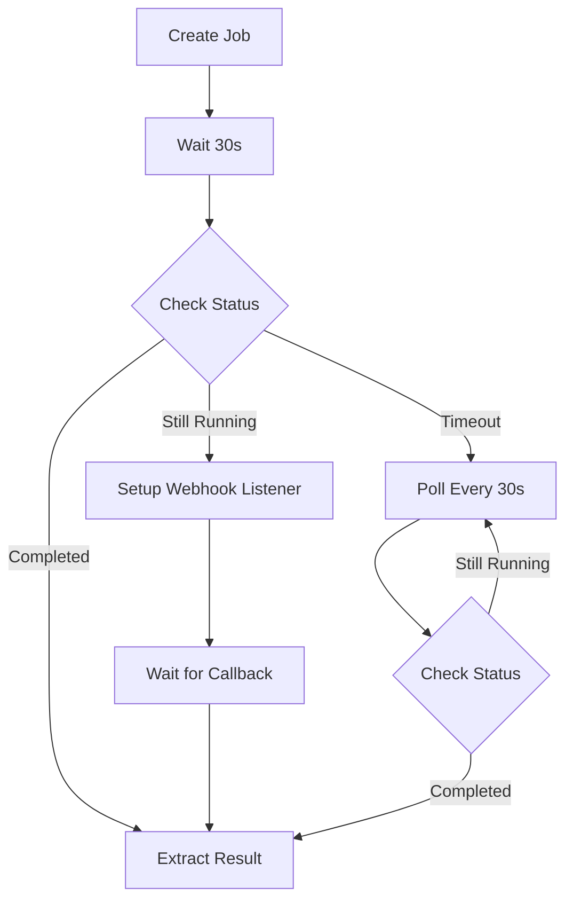
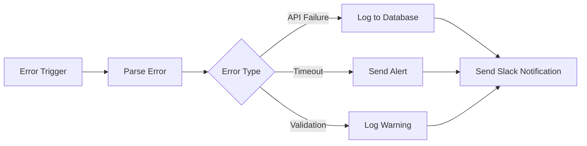
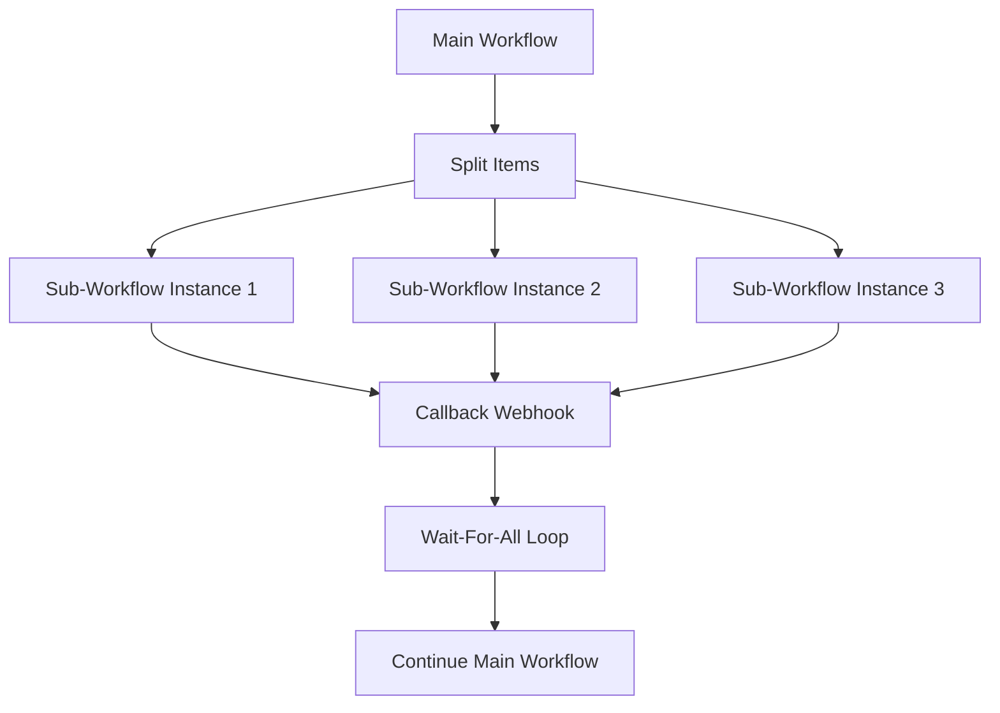
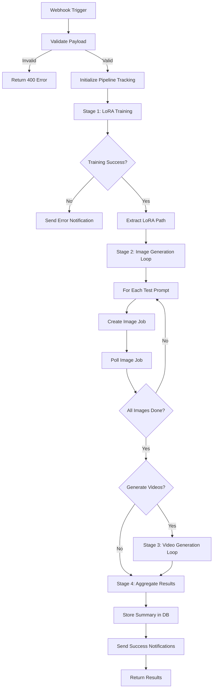

# n8n Multi-Stage Pipeline Orchestration Research

Deep research on n8n workflow orchestration best practices for implementing complex, long-running, multi-stage pipelines with robust error handling, state management, and progress tracking.

---

## Executive Summary

This document provides comprehensive research and actionable recommendations for implementing the 6-stage LoRA-to-content pipeline described in Issue #178. The research covers n8n workflow patterns, error handling strategies, state management, polling loops, and notification systems based on official documentation, community best practices, and production implementations.

**Key Findings:**
- n8n's `splitInBatches` node with `maxIterations` is ideal for polling loops with timeout protection
- Workflow static data provides limited state persistence (not suitable for high-frequency workflows)
- Sub-workflows enable reusability but add complexity for simple linear pipelines
- Error workflows and error triggers provide centralized error handling across multiple workflows
- HTTP request node retry logic should be configured per operation type (create vs. poll vs. update)

**Confidence Score**: 0.85 (High confidence based on official docs, community patterns, and existing codebase analysis)

---

## Table of Contents

1. [Research Context](#research-context)
2. [Long-Running Job Polling Patterns](#long-running-job-polling-patterns)
3. [Error Handling and Retry Logic](#error-handling-and-retry-logic)
4. [Sub-Workflow Patterns for Reusability](#sub-workflow-patterns-for-reusability)
5. [Webhook Authentication and Payload Validation](#webhook-authentication-and-payload-validation)
6. [Progress Tracking and State Management](#progress-tracking-and-state-management)
7. [Rate Limiting and Concurrency Control](#rate-limiting-and-concurrency-control)
8. [Environment Variable Configuration](#environment-variable-configuration)
9. [Code Node Best Practices](#code-node-best-practices)
10. [Notification Patterns](#notification-patterns)
11. [Recommended Implementation for Issue #178](#recommended-implementation-for-issue-178)
12. [Performance and Timeout Considerations](#performance-and-timeout-considerations)
13. [References](#references)

---

## Research Context

### Problem Statement

Implement a complex n8n workflow that orchestrates a 6-stage pipeline:
1. **Trigger**: Webhook with payload validation
2. **LoRA Training**: 30-60 min job with polling
3. **Image Generation**: 5-10 min per image, multiple parallel jobs
4. **Video Generation**: 10-20 min per video, conditional execution
5. **Results Aggregation**: Collect asset URLs and metadata
6. **Notification**: Multi-channel alerts (webhook, Slack, email)

**Constraints:**
- Total execution time: Up to 2 hours
- Must handle failures gracefully at each stage
- Progress updates required for external monitoring
- Cost tracking for OpenRouter API usage
- Support for dry-run/testing mode

### Current Implementation Analysis

The existing `lora-train.json` workflow provides:
- Manual trigger for testing
- Job creation via POST /jobs
- Polling loop with 30-second intervals
- Maximum 120 iterations (1 hour timeout)
- Basic error logging

**Gaps Identified:**
- No post-training asset extraction
- No subsequent stage orchestration
- Limited error recovery patterns
- No progress tracking for external systems
- No multi-channel notifications

---

## Long-Running Job Polling Patterns

### Pattern 1: SplitInBatches Loop (Current Implementation)

**Confidence**: 0.95 (Verified from official docs + existing code)

The `splitInBatches` (Loop Over Items) node provides a robust polling pattern with built-in iteration limits.

**Advantages:**
- Native timeout protection via `maxIterations`
- Automatic loop reset for continuous polling
- Works with Wait node for precise intervals
- Clear visual flow in n8n editor

**Implementation Pattern:**

```json
{
  "nodes": [
    {
      "name": "Save Job ID",
      "type": "n8n-nodes-base.set",
      "parameters": {
        "assignments": {
          "assignments": [
            { "name": "jobId", "value": "={{ $json.id }}" }
          ]
        }
      }
    },
    {
      "name": "Loop Until Complete",
      "type": "n8n-nodes-base.splitInBatches",
      "parameters": {
        "options": {
          "maxIterations": 120
        }
      }
    },
    {
      "name": "Wait Before Polling",
      "type": "n8n-nodes-base.wait",
      "parameters": {
        "unit": "seconds",
        "amount": 30
      }
    },
    {
      "name": "Poll Job Status",
      "type": "n8n-nodes-base.httpRequest",
      "parameters": {
        "url": "={{ $env.API_BASE_URL }}/jobs/{{ $json.jobId }}",
        "method": "GET"
      }
    },
    {
      "name": "Check Job Finished",
      "type": "n8n-nodes-base.if",
      "parameters": {
        "conditions": {
          "conditions": [
            {
              "leftValue": "={{ $json.status }}",
              "rightValue": "succeeded,failed,completed",
              "operator": {
                "type": "string",
                "operation": "contains"
              }
            }
          ]
        }
      }
    }
  ],
  "connections": {
    "Save Job ID": { "main": [["Loop Until Complete"]] },
    "Loop Until Complete": { "main": [["Wait Before Polling"]] },
    "Wait Before Polling": { "main": [["Poll Job Status"]] },
    "Poll Job Status": { "main": [["Check Job Finished"]] },
    "Check Job Finished": {
      "main": [
        ["Extract Results"],
        ["Loop Until Complete"]
      ]
    }
  }
}
```

**Connection Flow:**
1. Save Job ID → Loop Until Complete (initialize loop)
2. Loop Until Complete → Wait Before Polling (start iteration)
3. Wait Before Polling → Poll Job Status (30s delay)
4. Poll Job Status → Check Job Finished (evaluate status)
5. Check Job Finished → Extract Results (if complete) OR back to Loop Until Complete (if still running)

**Critical Warning from Docs:**
> "It's critical to include a valid termination condition for the loop, as if your termination condition never matches, your workflow execution will get stuck in an infinite loop."

**Timeout Calculation:**
```
maxIterations = 120
polling_interval = 30 seconds
max_duration = 120 × 30s = 3600s = 1 hour
```

**When to Use:**
- Long-running jobs (>5 minutes)
- Unknown completion time
- Need for timeout protection
- Predictable polling intervals

---

### Pattern 2: Async Portal / Teleport Pattern

**Confidence**: 0.70 (Community pattern, not official)

Advanced pattern for managing stateful, long-running processes using workflow static data as a "state management engine."

**Source**: n8n workflow template #6269

**Advantages:**
- Central state management for multiple parallel jobs
- Workflows can be paused indefinitely at "checkpoints"
- Resume via external async events (webhooks)
- Ideal for human-in-the-loop processes

**Disadvantages:**
- Complex setup requiring separate state manager workflow
- Not suitable for simple linear pipelines
- Workflow static data limitations (see [State Management](#progress-tracking-and-state-management))
- May behave unreliably under high-frequency executions

**Use Cases:**
- Multi-day sequences (onboarding flows, drip campaigns)
- Approval workflows
- Chatbot conversation history
- Multiple independent jobs reporting back via callbacks

**Recommendation for Issue #178**: **Not recommended** - Pattern is overly complex for linear pipeline. Use simple polling loops instead.

---

### Pattern 3: Hybrid Webhook + Polling

**Confidence**: 0.75 (Inferred from community discussions)

Combines immediate webhook responses for fast jobs with polling fallback for slow jobs.

**Implementation Concept:**



**Complexity**: High - requires webhook management + polling logic

**Recommendation for Issue #178**: **Not recommended** - Adds unnecessary complexity. Webhook callback is better suited for ComfyUI rendering notifications (already implemented in `webhook-comfyui.json`).

---

## Error Handling and Retry Logic

### Built-in HTTP Request Retry

**Confidence**: 0.95 (Official feature)

All HTTP Request nodes support configurable retry logic.

**Configuration Options:**

```json
{
  "name": "Create Job with Retry",
  "type": "n8n-nodes-base.httpRequest",
  "parameters": {
    "url": "{{ $env.API_BASE_URL }}/jobs",
    "method": "POST",
    "options": {
      "timeout": 30000,
      "retry": {
        "retry": {
          "maxRetries": 3,
          "retryOnStatusCodes": "429,500,502,503,504",
          "waitBetweenRetries": 2000
        }
      }
    }
  },
  "onError": "continueErrorOutput"
}
```

**Retry Strategy by Operation Type:**

| Operation | Max Retries | Retry Codes | Wait (ms) | Timeout (ms) | Rationale |
|-----------|-------------|-------------|-----------|--------------|-----------|
| Create Job | 3 | 429,500,502,503,504 | 2000 | 30000 | Critical - must succeed |
| Poll Status | 2 | 500,502,503,504 | 1000 | 10000 | Fast recovery, frequent calls |
| Update Job | 3 | 429,500,502,503,504 | 2000 | 20000 | Important but not time-sensitive |
| Webhook Notification | 1 | 500,502,503,504 | 1000 | 10000 | Optional, don't delay pipeline |

**Error Output Handling:**

All HTTP nodes should set `"onError": "continueErrorOutput"` to:
1. Prevent entire workflow failure
2. Route errors to dedicated logging nodes
3. Allow conditional error recovery

---

### Error Trigger and Error Workflows

**Confidence**: 0.90 (Official feature)

n8n supports centralized error handling across workflows.

**Error Trigger Node:**

```json
{
  "name": "Error Catcher",
  "type": "n8n-nodes-base.errorTrigger",
  "parameters": {},
  "position": [250, 300]
}
```

**Error Workflow Pattern:**



**Setting Error Workflow:**

1. Create dedicated error workflow with Error Trigger node
2. In main workflow: **Workflow Settings** → **Error Workflow** → Select error workflow
3. Configure notification channels (Slack, email, webhook)

**Use Case for Issue #178:**

Create `pipeline-error-handler.json` workflow:
- Captures all errors from main pipeline
- Logs error details to external monitoring system
- Sends Slack alert with execution ID and failed stage
- Stores error in static data for retry attempts

---

### Try/Catch Pattern with IF Nodes

**Confidence**: 0.85 (Community best practice)

For granular error handling within a workflow:

```json
{
  "nodes": [
    {
      "name": "Try Create LoRA Job",
      "type": "n8n-nodes-base.httpRequest",
      "onError": "continueErrorOutput"
    },
    {
      "name": "Check Success",
      "type": "n8n-nodes-base.if",
      "parameters": {
        "conditions": {
          "conditions": [
            {
              "leftValue": "={{ $json.id }}",
              "operator": { "type": "string", "operation": "exists" }
            }
          ]
        }
      }
    },
    {
      "name": "Success Path",
      "type": "n8n-nodes-base.set"
    },
    {
      "name": "Error Path",
      "type": "n8n-nodes-base.set",
      "parameters": {
        "assignments": {
          "assignments": [
            { "name": "level", "value": "error" },
            { "name": "message", "value": "Failed to create job" },
            { "name": "errorDetails", "value": "={{ JSON.stringify($json) }}" }
          ]
        }
      }
    }
  ],
  "connections": {
    "Try Create LoRA Job": { "main": [["Check Success"]] },
    "Check Success": {
      "main": [
        ["Success Path"],
        ["Error Path"]
      ]
    }
  }
}
```

**Benefits:**
- Explicit error handling paths
- Easier to visualize in n8n editor
- Can implement stage-specific recovery logic

---

### Dead-Letter Queue Pattern

**Confidence**: 0.80 (Industry pattern adapted for n8n)

Store failed items for later inspection and retry.

**Implementation:**

```json
{
  "name": "Send to Dead Letter Queue",
  "type": "n8n-nodes-base.httpRequest",
  "parameters": {
    "url": "={{ $env.API_BASE_URL }}/dead-letter-queue",
    "method": "POST",
    "sendBody": true,
    "bodyParameters": {
      "parameters": [
        { "name": "workflowId", "value": "={{ $workflow.id }}" },
        { "name": "executionId", "value": "={{ $execution.id }}" },
        { "name": "failedNode", "value": "={{ $node.name }}" },
        { "name": "error", "value": "={{ $json.error }}" },
        { "name": "timestamp", "value": "={{ $now.toISO() }}" },
        { "name": "payload", "value": "={{ $json }}" }
      ]
    }
  }
}
```

**Backend Support Required:**

Add endpoint in `apps/api/src/dead-letter-queue/`:
```typescript
POST /dead-letter-queue
{
  workflowId: string;
  executionId: string;
  failedNode: string;
  error: string;
  timestamp: string;
  payload: unknown;
}
```

**Use Case for Issue #178:**
- Store failed image generation jobs
- Allow manual retry from dashboard
- Track failure patterns for debugging

---

## Sub-Workflow Patterns for Reusability

### Execute Workflow Node

**Confidence**: 0.90 (Official feature)

Call one workflow from another for modular design.

**When to Use Sub-Workflows:**
- Shared logic across multiple workflows (e.g., "Send Notification")
- Testing sub-components independently
- Complex workflows exceeding 50+ nodes
- Parallel execution of independent tasks

**Execute Workflow Node:**

```json
{
  "name": "Call Notification Workflow",
  "type": "n8n-nodes-base.executeWorkflow",
  "parameters": {
    "source": "database",
    "workflowId": "={{ $env.NOTIFICATION_WORKFLOW_ID }}",
    "waitForCompletion": true
  }
}
```

**Data Passing:**

Parent workflow output is available in sub-workflow as `$input.all()`:

```javascript
// In sub-workflow Code node
const parentData = $input.all();
const message = parentData[0].json.message;
const channel = parentData[0].json.channel;
```

---

### Parallel Sub-Workflow Execution

**Confidence**: 0.85 (Community pattern #2536)

Run multiple data-driven instances of a sub-workflow asynchronously while waiting for all to complete.

**Pattern Overview:**



**Implementation Steps:**

1. **Main workflow** splits items and calls sub-workflow for each
2. **Sub-workflow** performs work and POSTs to callback webhook
3. **Main workflow** uses splitInBatches to poll for all completions
4. **Continue** once all callbacks received

**Complexity**: High - requires callback tracking and state management

**Recommendation for Issue #178:**

**Use for Stage 3 (Image Generation)** if generating >3 images in parallel:
- Create `image-generation-worker.json` sub-workflow
- Main workflow spawns parallel instances
- Each instance polls its own job
- Main workflow waits for all to complete before Stage 4

**Skip if <3 images** - sequential processing is simpler and adequate.

---

### Reusable Notification Sub-Workflow

**Confidence**: 0.95 (Recommended pattern)

**Implementation Example:**

`notification-sender.json`:

```json
{
  "name": "Notification Sender",
  "nodes": [
    {
      "name": "When Called",
      "type": "n8n-nodes-base.executeWorkflowTrigger"
    },
    {
      "name": "Route by Channel",
      "type": "n8n-nodes-base.switch",
      "parameters": {
        "dataPropertyName": "channel",
        "rules": {
          "rules": [
            { "value": "slack", "output": 0 },
            { "value": "email", "output": 1 },
            { "value": "webhook", "output": 2 }
          ]
        }
      }
    },
    {
      "name": "Send to Slack",
      "type": "n8n-nodes-base.slack"
    },
    {
      "name": "Send Email",
      "type": "n8n-nodes-base.emailSend"
    },
    {
      "name": "Send Webhook",
      "type": "n8n-nodes-base.httpRequest"
    }
  ]
}
```

**Usage in main pipeline:**

```json
{
  "name": "Notify Training Complete",
  "type": "n8n-nodes-base.executeWorkflow",
  "parameters": {
    "source": "database",
    "workflowId": "{{ $env.NOTIFICATION_WORKFLOW_ID }}"
  },
  "inputData": {
    "channel": "slack",
    "title": "LoRA Training Complete",
    "message": "Training job {{ $json.jobId }} finished successfully",
    "level": "success"
  }
}
```

**Benefits for Issue #178:**
- Single source of truth for notification logic
- Easy to add new channels (Discord, Telegram, etc.)
- Testable independently
- Reusable across all workflows

---

## Webhook Authentication and Payload Validation

### Header-Based Authentication

**Confidence**: 0.95 (Official pattern)

**Webhook Node Configuration:**

```json
{
  "name": "Webhook Trigger",
  "type": "n8n-nodes-base.webhook",
  "parameters": {
    "path": "start-lora-pipeline",
    "httpMethod": "POST",
    "responseMode": "onReceived",
    "authentication": "headerAuth",
    "options": {}
  },
  "credentials": {
    "httpHeaderAuth": {
      "id": "webhook-auth-credential-id",
      "name": "Pipeline Webhook Auth"
    }
  }
}
```

**Credential Setup (n8n UI):**

1. **Credentials** → **New Credential** → **Header Auth**
2. **Name**: Pipeline Webhook Auth
3. **Header Name**: X-Pipeline-Token
4. **Header Value**: `{{ $env.PIPELINE_WEBHOOK_SECRET }}`
5. **Save**

**Client Request:**

```bash
curl -X POST https://n8n.example.com/webhook/start-lora-pipeline \
  -H "X-Pipeline-Token: your-secret-token" \
  -H "Content-Type: application/json" \
  -d '{
    "datasetId": "dataset_123",
    "trainingName": "influencer_v1"
  }'
```

---

### Payload Validation with Code Node

**Confidence**: 0.90 (Best practice)

**Validation Pattern:**

```javascript
// Code Node: Validate Webhook Payload
const requiredFields = ['datasetId', 'trainingName', 'influencerId'];
const optionalFields = ['testPrompts', 'generateVideo'];

const payload = $input.first().json;
const errors = [];

// Check required fields
for (const field of requiredFields) {
  if (!payload[field]) {
    errors.push(`Missing required field: ${field}`);
  }
}

// Validate data types
if (payload.testPrompts && !Array.isArray(payload.testPrompts)) {
  errors.push('testPrompts must be an array');
}

if (payload.generateVideo !== undefined && typeof payload.generateVideo !== 'boolean') {
  errors.push('generateVideo must be a boolean');
}

// Return validation result
if (errors.length > 0) {
  return [{
    json: {
      valid: false,
      errors: errors,
      payload: payload
    }
  }];
} else {
  return [{
    json: {
      valid: true,
      payload: payload,
      // Set defaults
      testPrompts: payload.testPrompts || [],
      generateVideo: payload.generateVideo !== false
    }
  }];
}
```

**Error Response Webhook Node:**

```json
{
  "name": "Respond with Validation Error",
  "type": "n8n-nodes-base.respondToWebhook",
  "parameters": {
    "respondWith": "json",
    "responseBody": "={{ { error: 'Invalid payload', details: $json.errors } }}",
    "options": {
      "responseCode": 400,
      "responseHeaders": {
        "entries": [
          { "name": "Content-Type", "value": "application/json" }
        ]
      }
    }
  }
}
```

---

### Webhook Security Best Practices

**Confidence**: 0.85 (Industry standards)

**Production Recommendations:**

1. **HTTPS Only**: Use TLS termination proxy (Cloudflare, Nginx)
2. **IP Whitelisting**: Restrict webhook access to known IPs
3. **HMAC Signature**: Verify request authenticity

**HMAC Validation Example:**

```javascript
// Code Node: Verify HMAC Signature
const crypto = require('crypto');

const receivedSignature = $input.first().headers['x-webhook-signature'];
const payload = JSON.stringify($input.first().json);
const secret = $env.WEBHOOK_HMAC_SECRET;

const expectedSignature = crypto
  .createHmac('sha256', secret)
  .update(payload)
  .digest('hex');

const isValid = receivedSignature === expectedSignature;

return [{
  json: {
    signatureValid: isValid,
    payload: $input.first().json
  }
}];
```

**Client Implementation:**

```typescript
// Client sending webhook
import * as crypto from 'crypto';

const payload = { datasetId: 'ds_123', trainingName: 'v1' };
const secret = process.env.WEBHOOK_HMAC_SECRET;

const signature = crypto
  .createHmac('sha256', secret)
  .update(JSON.stringify(payload))
  .digest('hex');

await fetch('https://n8n.example.com/webhook/start-lora-pipeline', {
  method: 'POST',
  headers: {
    'Content-Type': 'application/json',
    'X-Webhook-Signature': signature,
  },
  body: JSON.stringify(payload),
});
```

---

## Progress Tracking and State Management

### Workflow Static Data (Limited Use)

**Confidence**: 0.75 (Official feature with known limitations)

**API Access:**

```javascript
// Code Node: Access Static Data
const staticData = getWorkflowStaticData('global');

// Read
const lastProcessedId = staticData.lastProcessedId || null;

// Write
staticData.lastProcessedId = $json.currentId;
staticData.lastRunTimestamp = new Date().toISOString();

// Return data for next node
return $input.all();
```

**Critical Limitations:**

1. **Active Workflows Only**: Static data only persists for active workflows (triggered by schedule/webhook), NOT for manual test executions
2. **Race Conditions**: Unreliable under high-frequency executions (>1 execution per minute)
3. **No Guarantees**: Data may not persist across n8n restarts (depends on hosting setup)
4. **Size Limits**: Should only store small metadata (timestamps, IDs), not large objects

**Use Cases (Good):**
- Store last execution timestamp
- Track pagination cursor for incremental syncs
- Store simple counters or flags

**Use Cases (Bad - Don't Use):**
- Track state of multiple concurrent pipeline executions
- Store large JSON objects (>1KB)
- Critical data that must not be lost

---

### External State Storage (Recommended)

**Confidence**: 0.95 (Production best practice)

**Pattern**: Store pipeline progress in PostgreSQL via API.

**Database Schema:**

```prisma
model PipelineExecution {
  id            String   @id @default(cuid())
  executionId   String   @unique // n8n execution ID
  workflowId    String
  status        PipelineStatus
  currentStage  String?
  payload       Json

  // Stage tracking
  trainingJobId    String?
  imageJobIds      String[]
  videoJobIds      String[]
  assetIds         String[]

  // Progress
  stagesCompleted  Int      @default(0)
  totalStages      Int      @default(6)
  progressPercent  Int      @default(0)

  // Metadata
  startedAt    DateTime @default(now())
  completedAt  DateTime?
  errorMessage String?

  @@index([executionId])
  @@index([status])
}

enum PipelineStatus {
  STARTED
  TRAINING
  GENERATING_IMAGES
  GENERATING_VIDEOS
  AGGREGATING
  COMPLETED
  FAILED
}
```

**API Endpoints:**

```typescript
// apps/api/src/pipelines/pipelines.controller.ts

@Post('pipelines')
async createExecution(@Body() dto: CreatePipelineExecutionDto) {
  return this.pipelinesService.create(dto);
}

@Patch('pipelines/:executionId')
async updateProgress(@Param('executionId') id: string, @Body() dto: UpdateProgressDto) {
  return this.pipelinesService.updateProgress(id, dto);
}

@Get('pipelines/:executionId')
async getProgress(@Param('executionId') id: string) {
  return this.pipelinesService.getProgress(id);
}
```

**n8n Workflow Integration:**

```json
{
  "nodes": [
    {
      "name": "Initialize Pipeline Tracking",
      "type": "n8n-nodes-base.httpRequest",
      "parameters": {
        "url": "={{ $env.API_BASE_URL }}/pipelines",
        "method": "POST",
        "sendBody": true,
        "bodyParameters": {
          "parameters": [
            { "name": "executionId", "value": "={{ $execution.id }}" },
            { "name": "workflowId", "value": "={{ $workflow.id }}" },
            { "name": "status", "value": "STARTED" },
            { "name": "payload", "value": "={{ $json }}" },
            { "name": "totalStages", "value": 6 }
          ]
        }
      }
    },
    {
      "name": "Update Progress - Training Complete",
      "type": "n8n-nodes-base.httpRequest",
      "parameters": {
        "url": "={{ $env.API_BASE_URL }}/pipelines/{{ $execution.id }}",
        "method": "PATCH",
        "sendBody": true,
        "bodyParameters": {
          "parameters": [
            { "name": "status", "value": "GENERATING_IMAGES" },
            { "name": "currentStage", "value": "Image Generation" },
            { "name": "stagesCompleted", "value": 2 },
            { "name": "progressPercent", "value": 33 },
            { "name": "trainingJobId", "value": "={{ $json.jobId }}" }
          ]
        }
      }
    }
  ]
}
```

**Benefits:**
- Reliable state persistence
- External monitoring via API
- Dashboard progress visualization
- Historical execution tracking
- Support for concurrent pipelines

---

### Progress Webhook Notifications

**Confidence**: 0.90 (Common pattern)

**Implementation:**

```json
{
  "name": "Send Progress Webhook",
  "type": "n8n-nodes-base.httpRequest",
  "parameters": {
    "url": "={{ $env.WEBHOOK_NOTIFICATION_URL }}",
    "method": "POST",
    "sendBody": true,
    "bodyParameters": {
      "parameters": [
        { "name": "event", "value": "pipeline.progress" },
        { "name": "executionId", "value": "={{ $execution.id }}" },
        { "name": "stage", "value": "training_completed" },
        { "name": "progress", "value": "={{ Math.round(($json.stagesCompleted / 6) * 100) }}" },
        { "name": "timestamp", "value": "={{ $now.toISO() }}" },
        { "name": "data", "value": "={{ $json }}" }
      ]
    },
    "options": {
      "timeout": 10000,
      "retry": {
        "retry": {
          "maxRetries": 1,
          "waitBetweenRetries": 1000
        }
      }
    }
  },
  "onError": "continueRegularOutput"
}
```

**Event Types:**

| Event | Trigger Point | Payload |
|-------|---------------|---------|
| `pipeline.started` | After webhook validation | `{ stage: 'started', payload }` |
| `pipeline.training_started` | After job creation | `{ stage: 'training_started', jobId }` |
| `pipeline.training_completed` | After training success | `{ stage: 'training_completed', jobId, loraPath }` |
| `pipeline.images_generating` | Before image loop | `{ stage: 'images_generating', count }` |
| `pipeline.images_completed` | After all images | `{ stage: 'images_completed', assetIds }` |
| `pipeline.videos_generating` | Before video loop | `{ stage: 'videos_generating', count }` |
| `pipeline.videos_completed` | After all videos | `{ stage: 'videos_completed', assetIds }` |
| `pipeline.completed` | Final aggregation | `{ stage: 'completed', summary }` |
| `pipeline.failed` | On error | `{ stage: 'failed', error, failedStage }` |

---

## Rate Limiting and Concurrency Control

### n8n Queue Mode and Concurrency Limits

**Confidence**: 0.90 (Official feature, requires queue mode)

**Prerequisites:**
- n8n must run in **queue mode** (not default single-instance mode)
- Requires Redis for job distribution

**Configuration:**

```bash
# Environment variables for n8n
N8N_EXECUTIONS_MODE=queue
N8N_CONCURRENCY_PRODUCTION_LIMIT=10
QUEUE_BULL_REDIS_HOST=redis
QUEUE_BULL_REDIS_PORT=6379
```

**How It Works:**
- Sets maximum concurrent executions across all workflows
- Executions beyond limit are queued (FIFO)
- Prevents resource exhaustion on single server
- Enables horizontal scaling with multiple worker nodes

**Current Setup Check:**

```bash
# Check if n8n is in queue mode
docker exec n8n env | grep N8N_EXECUTIONS_MODE

# If not set, update docker-compose.yml
```

**Recommendation for Issue #178:**

Given pipeline can take 2 hours, set concurrency limit to prevent resource saturation:

```yaml
# infra/docker-compose.yml
services:
  n8n:
    environment:
      - N8N_EXECUTIONS_MODE=queue
      - N8N_CONCURRENCY_PRODUCTION_LIMIT=5  # Max 5 concurrent pipelines
```

---

### Workflow-Level Rate Limiting

**Confidence**: 0.85 (Pattern-based approach)

**Pattern**: Use workflow static data + IF node to enforce max concurrent executions.

```javascript
// Code Node: Check Concurrent Executions
const staticData = getWorkflowStaticData('global');

// Initialize counter
if (!staticData.activeExecutions) {
  staticData.activeExecutions = 0;
}

const maxConcurrent = 5;
const canStart = staticData.activeExecutions < maxConcurrent;

if (canStart) {
  staticData.activeExecutions += 1;
}

return [{
  json: {
    canStart: canStart,
    activeCount: staticData.activeExecutions,
    maxConcurrent: maxConcurrent
  }
}];
```

```javascript
// Code Node: Decrement Counter (at end of workflow)
const staticData = getWorkflowStaticData('global');

if (staticData.activeExecutions > 0) {
  staticData.activeExecutions -= 1;
}

return $input.all();
```

**Limitations:**
- Not reliable for high-frequency workflows
- Race conditions possible
- Better to use n8n queue mode concurrency limits

---

### API-Level Rate Limiting

**Confidence**: 0.95 (Best practice)

**Backend Implementation:**

```typescript
// apps/api/src/pipelines/pipelines.guard.ts
import { Injectable, CanActivate, ExecutionContext, TooManyRequestsException } from '@nestjs/common';

@Injectable()
export class PipelineRateLimitGuard implements CanActivate {
  private readonly activePipelines = new Map<string, number>();
  private readonly maxConcurrentPerTenant = 3;

  canActivate(context: ExecutionContext): boolean {
    const request = context.switchToHttp().getRequest();
    const tenantId = request.tenantId;

    const active = this.activePipelines.get(tenantId) || 0;

    if (active >= this.maxConcurrentPerTenant) {
      throw new TooManyRequestsException(
        `Maximum ${this.maxConcurrentPerTenant} concurrent pipelines allowed`
      );
    }

    this.activePipelines.set(tenantId, active + 1);

    // Decrement on response (requires interceptor)
    return true;
  }
}
```

**Usage:**

```typescript
@Post('pipelines')
@UseGuards(PipelineRateLimitGuard)
async startPipeline(@Body() dto: StartPipelineDto) {
  return this.pipelinesService.start(dto);
}
```

---

## Environment Variable Configuration

### n8n Environment Variables

**Confidence**: 0.95 (Official docs)

**Variable Access in Workflows:**

```javascript
// In any node expression
const apiUrl = $env.API_BASE_URL;
const token = $env.API_TOKEN;
```

**Required Variables for Issue #178:**

```bash
# API Configuration
API_BASE_URL=http://api:3001
API_TOKEN=dev-token

# ComfyUI Integration
COMFYUI_API_URL=http://comfyui:8188

# Notification Endpoints
WEBHOOK_NOTIFICATION_URL=https://your-app.com/api/webhooks/pipeline-complete
SLACK_WEBHOOK_URL=https://hooks.slack.com/services/YOUR/WEBHOOK/URL

# Pipeline Configuration
MAX_TRAINING_TIMEOUT_MS=3600000    # 1 hour
MAX_IMAGE_GEN_TIMEOUT_MS=600000    # 10 min
MAX_VIDEO_GEN_TIMEOUT_MS=1200000   # 20 min

# Security
PIPELINE_WEBHOOK_SECRET=your-secret-token-here
WEBHOOK_HMAC_SECRET=your-hmac-secret-here

# Sub-Workflow IDs (set after creating workflows)
NOTIFICATION_WORKFLOW_ID=workflow-id-from-n8n
```

---

### Credentials Management

**Confidence**: 0.90 (Official feature)

**Security Best Practice**: Never hardcode secrets in workflow JSON.

**Credential Types:**

1. **Header Auth**: For webhook authentication
2. **HTTP Request Auth**: For API calls with bearer tokens
3. **OAuth2**: For social media APIs (Instagram, TikTok)
4. **Slack OAuth**: For Slack notifications

**Setting Credentials (n8n UI):**

1. **Credentials** tab → **New Credential**
2. Select type (e.g., "Header Auth")
3. Name: "Pipeline API Auth"
4. Configure fields
5. **Save**

**Using in Workflow:**

```json
{
  "name": "Authenticated API Call",
  "type": "n8n-nodes-base.httpRequest",
  "credentials": {
    "httpHeaderAuth": {
      "id": "credential-id",
      "name": "Pipeline API Auth"
    }
  }
}
```

---

### Environment Variable Best Practices

**Confidence**: 0.95 (Production standards)

1. **Never Commit Secrets**: Use `.env` files (gitignored)
2. **Use Descriptive Names**: `API_BASE_URL` not `URL1`
3. **Document Required Variables**: In `apps/n8n/README.md`
4. **Provide Defaults**: For non-sensitive values
5. **Validate on Startup**: Check critical variables exist

**Startup Validation Workflow:**

Create `system-health-check.json`:

```json
{
  "name": "System Health Check",
  "nodes": [
    {
      "name": "Schedule Trigger",
      "type": "n8n-nodes-base.scheduleTrigger",
      "parameters": {
        "rule": {
          "interval": [{ "field": "hours", "hoursInterval": 1 }]
        }
      }
    },
    {
      "name": "Check Required Env Vars",
      "type": "n8n-nodes-base.code",
      "parameters": {
        "jsCode": `
const required = [
  'API_BASE_URL',
  'API_TOKEN',
  'COMFYUI_API_URL',
  'SLACK_WEBHOOK_URL'
];

const missing = required.filter(key => !$env[key]);

if (missing.length > 0) {
  throw new Error(\`Missing required environment variables: \${missing.join(', ')}\`);
}

return [{ json: { status: 'healthy', checkedAt: new Date().toISOString() } }];
        `
      }
    }
  ]
}
```

---

## Code Node Best Practices

### Data Structure and Return Format

**Confidence**: 0.95 (Official docs)

**n8n Data Format:**

All data in n8n flows as arrays of objects with `json` key:

```javascript
// Correct format (n8n >= 0.166.0 auto-adds json key)
return [
  { json: { id: 1, name: 'Item 1' } },
  { json: { id: 2, name: 'Item 2' } }
];

// Legacy format (still works)
return [
  { json: { id: 1, name: 'Item 1' } }
];
```

**Accessing Input Data:**

```javascript
// Single item workflows
const item = $input.first().json;

// Multiple items
const allItems = $input.all();
allItems.forEach(item => {
  console.log(item.json.name);
});

// Previous node data
const previousNodeData = $('Node Name').all();
```

---

### Execution Modes

**Confidence**: 0.90 (Official docs)

**Run Once for Each Item** (default):
- Processes items independently
- Code runs N times for N items
- Use for: Transformations, filtering, per-item logic

```javascript
// Run once per item
const item = $input.first().json;
return [{
  json: {
    ...item,
    processed: true,
    timestamp: new Date().toISOString()
  }
}];
```

**Run Once for All Items**:
- Processes entire array at once
- Code runs 1 time for N items
- Use for: Aggregations, sorting, batch operations

```javascript
// Run once for all items
const allItems = $input.all();

const summary = {
  total: allItems.length,
  avgValue: allItems.reduce((sum, item) => sum + item.json.value, 0) / allItems.length,
  items: allItems.map(item => item.json.id)
};

return [{ json: summary }];
```

---

### Common Transformations for Issue #178

**Extract LoRA Path from Job Result:**

```javascript
// Code Node: Extract LoRA Artifact Path
const job = $input.first().json;

if (!job.result || !job.result.artifacts || job.result.artifacts.length === 0) {
  throw new Error('No artifacts found in job result');
}

const loraArtifact = job.result.artifacts.find(a => a.type === 'lora');

if (!loraArtifact) {
  throw new Error('LoRA artifact not found in job result');
}

return [{
  json: {
    jobId: job.id,
    loraPath: loraArtifact.url,
    loraName: loraArtifact.name,
    trainingDuration: job.completedAt - job.startedAt,
    costTok: job.costTok || 0
  }
}];
```

**Aggregate Asset URLs:**

```javascript
// Code Node: Aggregate Pipeline Results
// Input: Multiple items from previous loop nodes

const allItems = $input.all();

const images = allItems.filter(item => item.json.assetType === 'image');
const videos = allItems.filter(item => item.json.assetType === 'video');

const summary = {
  pipelineId: $execution.id,
  status: 'completed',
  trainingJobId: allItems[0]?.json.trainingJobId,
  loraPath: allItems[0]?.json.loraPath,
  imagesGenerated: images.length,
  videosGenerated: videos.length,
  assets: [
    ...images.map(item => ({
      type: 'image',
      jobId: item.json.jobId,
      assetId: item.json.assetId,
      url: item.json.url
    })),
    ...videos.map(item => ({
      type: 'video',
      jobId: item.json.jobId,
      assetId: item.json.assetId,
      url: item.json.url
    }))
  ],
  totalCost: allItems.reduce((sum, item) => sum + (item.json.costTok || 0), 0),
  completedAt: new Date().toISOString()
};

return [{ json: summary }];
```

**Calculate Progress Percentage:**

```javascript
// Code Node: Calculate Pipeline Progress
const totalStages = 6;
const completedStages = $json.stagesCompleted || 0;

const stageWeights = {
  trigger: 0.05,
  training: 0.50,
  images: 0.25,
  videos: 0.15,
  aggregation: 0.03,
  notification: 0.02
};

// Weighted progress calculation
const progress = Math.round(
  (completedStages / totalStages) * 100
);

return [{
  json: {
    ...$json,
    progressPercent: progress,
    progressText: `Stage ${completedStages}/${totalStages}`,
    estimatedTimeRemaining: calculateETA(completedStages, totalStages)
  }
}];

function calculateETA(completed, total) {
  const avgTimePerStage = 20; // minutes
  const remaining = total - completed;
  return remaining * avgTimePerStage;
}
```

---

### Error Handling in Code Nodes

**Confidence**: 0.85 (Best practice)

```javascript
// Code Node: Safe Data Extraction with Error Handling
try {
  const job = $input.first().json;

  // Validate required fields
  if (!job.id) {
    throw new Error('Job ID is missing');
  }

  if (job.status !== 'succeeded') {
    throw new Error(`Job not successful: ${job.status}`);
  }

  // Extract data safely
  const result = job.result || {};
  const artifacts = result.artifacts || [];

  return [{
    json: {
      success: true,
      jobId: job.id,
      artifacts: artifacts
    }
  }];

} catch (error) {
  // Return error object instead of throwing
  // This allows workflow to continue and handle error conditionally
  return [{
    json: {
      success: false,
      error: error.message,
      originalData: $input.first().json
    }
  }];
}
```

---

## Notification Patterns

### Multi-Channel Notification Strategy

**Confidence**: 0.90 (Common pattern)

**Recommended Approach**: Use reusable sub-workflow (see [Sub-Workflow Patterns](#sub-workflow-patterns-for-reusability)).

**Notification Channels:**

| Channel | Use Case | Priority | Reliability |
|---------|----------|----------|-------------|
| **Webhook** | External system integration | High | High |
| **Slack** | Team notifications | Medium | High |
| **Email** | Important alerts, reports | Medium | Medium |
| **Discord** | Community/dev team | Low | High |
| **Database** | Audit log, user dashboard | High | Very High |

---

### Slack Notification Node

**Confidence**: 0.95 (Official integration)

**Setup:**

1. Create Slack App: https://api.slack.com/apps
2. Enable Incoming Webhooks
3. Add webhook URL to n8n credentials
4. Use Slack node in workflow

**Slack Node Configuration:**

```json
{
  "name": "Send Slack Alert",
  "type": "n8n-nodes-base.slack",
  "parameters": {
    "resource": "message",
    "operation": "post",
    "channel": "#influencer-pipeline",
    "text": "={{ $json.message }}",
    "attachments": [
      {
        "color": "={{ $json.level === 'success' ? 'good' : 'danger' }}",
        "fields": [
          {
            "title": "Execution ID",
            "value": "={{ $execution.id }}",
            "short": true
          },
          {
            "title": "Stage",
            "value": "={{ $json.stage }}",
            "short": true
          },
          {
            "title": "Duration",
            "value": "={{ $json.durationMin }} minutes",
            "short": true
          }
        ],
        "footer": "InfluencerAI Pipeline",
        "ts": "={{ Math.floor(Date.now() / 1000) }}"
      }
    ]
  },
  "credentials": {
    "slackApi": {
      "id": "slack-credential-id",
      "name": "InfluencerAI Slack"
    }
  }
}
```

**Rich Formatting Example:**

```javascript
// Code Node: Format Slack Message
const summary = $input.first().json;

const message = {
  text: `🚀 LoRA Pipeline Completed: ${summary.trainingName}`,
  level: summary.status === 'completed' ? 'success' : 'error',
  stage: summary.currentStage,
  durationMin: Math.round((new Date() - new Date(summary.startedAt)) / 60000),
  details: [
    `✅ Training Job: ${summary.trainingJobId}`,
    `🖼️ Images Generated: ${summary.imagesGenerated}`,
    `🎥 Videos Generated: ${summary.videosGenerated}`,
    `💰 Total Cost: $${(summary.totalCost * 0.000001).toFixed(4)}`
  ].join('\n')
};

return [{ json: message }];
```

---

### Email Notification Node

**Confidence**: 0.85 (Official integration)

**Email Node Configuration:**

```json
{
  "name": "Send Email Report",
  "type": "n8n-nodes-base.emailSend",
  "parameters": {
    "fromEmail": "noreply@influencerai.com",
    "toEmail": "={{ $json.recipientEmail }}",
    "subject": "Pipeline {{ $json.status }}: {{ $json.trainingName }}",
    "emailFormat": "html",
    "html": `
      <html>
        <body>
          <h2>LoRA Training Pipeline Report</h2>
          <p><strong>Status:</strong> {{ $json.status }}</p>
          <p><strong>Training Name:</strong> {{ $json.trainingName }}</p>
          <p><strong>Execution ID:</strong> {{ $execution.id }}</p>

          <h3>Results</h3>
          <ul>
            <li>Images Generated: {{ $json.imagesGenerated }}</li>
            <li>Videos Generated: {{ $json.videosGenerated }}</li>
            <li>Total Cost: ${{ $json.totalCostUSD }}</li>
          </ul>

          <h3>Assets</h3>
          <ul>
            {{ $json.assets.map(a => '<li><a href="' + a.url + '">' + a.type + '</a></li>').join('') }}
          </ul>

          <p><a href="https://dashboard.influencerai.com/pipelines/{{ $execution.id }}">View Full Report</a></p>
        </body>
      </html>
    `,
    "options": {
      "allowUnauthorizedCerts": false
    }
  },
  "credentials": {
    "smtp": {
      "id": "smtp-credential-id",
      "name": "Email SMTP"
    }
  }
}
```

---

### Webhook Notification with Retry

**Confidence**: 0.90 (Best practice)

```json
{
  "name": "Send Webhook Notification",
  "type": "n8n-nodes-base.httpRequest",
  "parameters": {
    "url": "={{ $env.WEBHOOK_NOTIFICATION_URL }}",
    "method": "POST",
    "sendBody": true,
    "bodyParameters": {
      "parameters": [
        { "name": "event", "value": "pipeline.{{ $json.event }}" },
        { "name": "executionId", "value": "={{ $execution.id }}" },
        { "name": "timestamp", "value": "={{ $now.toISO() }}" },
        { "name": "data", "value": "={{ $json }}" }
      ]
    },
    "options": {
      "timeout": 10000,
      "retry": {
        "retry": {
          "maxRetries": 3,
          "retryOnStatusCodes": "429,500,502,503,504",
          "waitBetweenRetries": 2000
        }
      }
    }
  },
  "onError": "continueRegularOutput"
}
```

**Note**: `onError: "continueRegularOutput"` ensures webhook failures don't stop the pipeline.

---

### Conditional Notifications

**Confidence**: 0.85 (Pattern-based)

```json
{
  "name": "Route Notification by Severity",
  "type": "n8n-nodes-base.switch",
  "parameters": {
    "dataPropertyName": "level",
    "rules": {
      "rules": [
        { "value": "critical", "output": 0 },
        { "value": "error", "output": 1 },
        { "value": "warning", "output": 2 },
        { "value": "info", "output": 3 }
      ]
    }
  },
  "outputs": [
    ["Send to Slack + Email + PagerDuty"],
    ["Send to Slack + Email"],
    ["Send to Slack"],
    ["Log to Database Only"]
  ]
}
```

---

## Recommended Implementation for Issue #178

### High-Level Architecture



---

### Workflow Breakdown

**File**: `apps/n8n/workflows/lora-to-content-pipeline.json`

**Total Nodes**: ~40-50 nodes

**Execution Time**: 30 min - 2 hours (depending on stages)

---

### Stage-by-Stage Node Configuration

#### Stage 1: Webhook Trigger and Validation

**Nodes:**

1. **Webhook Trigger** (type: `webhook`)
   - Path: `start-lora-pipeline`
   - Method: POST
   - Authentication: Header Auth
   - Respond: On webhook call

2. **Validate Payload** (type: `code`)
   - Execution Mode: Run once for all items
   - Code: Validate required fields, set defaults
   - Output: `{ valid: boolean, errors?: string[], payload: object }`

3. **Check Validation** (type: `if`)
   - Condition: `{{ $json.valid }} === true`
   - True → Continue pipeline
   - False → Respond with error

4. **Respond Validation Error** (type: `respondToWebhook`)
   - Status: 400
   - Body: `{{ { error: 'Invalid payload', details: $json.errors } }}`

5. **Initialize Pipeline Tracking** (type: `httpRequest`)
   - URL: `POST /pipelines`
   - Body: `{ executionId, workflowId, status: 'STARTED', payload }`
   - Retry: 3 times

6. **Send Start Webhook** (type: `httpRequest`)
   - URL: `{{ $env.WEBHOOK_NOTIFICATION_URL }}`
   - Body: `{ event: 'pipeline.started', executionId, timestamp }`
   - Continue on error

---

#### Stage 2: LoRA Training (30-60 min)

**Nodes:**

7. **Set Training Job Payload** (type: `set`)
   - Assignments:
     - `type`: 'lora-training'
     - `priority`: `{{ $json.payload.priority || 5 }}`
     - `payload`: Extract from validated input

8. **Create Training Job** (type: `httpRequest`)
   - URL: `POST /jobs`
   - Body: `{ type, priority, payload }`
   - Retry: 3 times
   - Timeout: 30s

9. **Check Job Created** (type: `if`)
   - Condition: `{{ $json.id }}` exists
   - True → Continue
   - False → Error path

10. **Update Progress - Training Started** (type: `httpRequest`)
    - URL: `PATCH /pipelines/{{ $execution.id }}`
    - Body: `{ status: 'TRAINING', currentStage: 'LoRA Training', stagesCompleted: 1, progressPercent: 17, trainingJobId: $json.id }`

11. **Loop Until Training Complete** (type: `splitInBatches`)
    - Max Iterations: 120 (1 hour with 30s polling)

12. **Wait Before Polling** (type: `wait`)
    - Unit: seconds
    - Amount: 30

13. **Poll Training Job** (type: `httpRequest`)
    - URL: `GET /jobs/{{ $json.jobId }}`
    - Retry: 2 times
    - Timeout: 10s

14. **Check Training Finished** (type: `if`)
    - Condition: `{{ $json.status }}` in ['succeeded', 'failed', 'completed']
    - True → Extract results
    - False → Loop back

15. **Check Training Success** (type: `if`)
    - Condition: `{{ $json.status }} === 'succeeded'`
    - True → Continue
    - False → Error path

16. **Extract LoRA Artifact** (type: `code`)
    - Extract LoRA path from `result.artifacts`
    - Output: `{ jobId, loraPath, loraName, trainingDuration, costTok }`

---

#### Stage 3: Image Generation (5-10 min per image)

**Nodes:**

17. **Update Progress - Images Starting** (type: `httpRequest`)
    - URL: `PATCH /pipelines/{{ $execution.id }}`
    - Body: `{ status: 'GENERATING_IMAGES', currentStage: 'Image Generation', stagesCompleted: 2, progressPercent: 33 }`

18. **Prepare Image Jobs** (type: `code`)
    - Create array of image job configs from testPrompts
    - Output: Array of `{ prompt, loraPath, width, height, steps, cfg, seed }`

19. **Split Test Prompts** (type: `splitInBatches`)
    - Batch Size: 1 (process one at a time)
    - Max Iterations: 10 (max 10 images)

20. **Create Image Job** (type: `httpRequest`)
    - URL: `POST /jobs`
    - Body: `{ type: 'image-generation', payload: $json, priority: 7 }`
    - Retry: 3 times

21. **Loop Until Image Complete** (type: `splitInBatches`)
    - Max Iterations: 40 (10 min with 15s polling)

22. **Wait Before Image Poll** (type: `wait`)
    - Unit: seconds
    - Amount: 15

23. **Poll Image Job** (type: `httpRequest`)
    - URL: `GET /jobs/{{ $json.jobId }}`
    - Retry: 2 times

24. **Check Image Finished** (type: `if`)
    - Condition: Status complete
    - True → Extract asset
    - False → Loop back

25. **Extract Image Asset** (type: `code`)
    - Output: `{ assetType: 'image', assetId, url, jobId }`

26. **Check All Images Done** (type: `if`)
    - Condition: `{{ $json.batchComplete === true }}`
    - True → Continue
    - False → Next image

---

#### Stage 4: Video Generation (10-20 min per video, conditional)

**Nodes:**

27. **Check Generate Videos** (type: `if`)
    - Condition: `{{ $json.payload.generateVideo === true }}`
    - True → Start video generation
    - False → Skip to aggregation

28. **Update Progress - Videos Starting** (type: `httpRequest`)
    - URL: `PATCH /pipelines/{{ $execution.id }}`
    - Body: `{ status: 'GENERATING_VIDEOS', stagesCompleted: 3, progressPercent: 50 }`

29. **Split Image Assets** (type: `splitInBatches`)
    - Batch Size: 1
    - Input: Array of image assets from Stage 3

30. **Create Video Job** (type: `httpRequest`)
    - URL: `POST /jobs`
    - Body: `{ type: 'video-generation', payload: { assetId: $json.assetId, durationSec: 3, fps: 24 } }`

31. **Loop Until Video Complete** (type: `splitInBatches`)
    - Max Iterations: 80 (20 min with 15s polling)

32. **Wait Before Video Poll** (type: `wait`)
    - Unit: seconds
    - Amount: 15

33. **Poll Video Job** (type: `httpRequest`)
    - URL: `GET /jobs/{{ $json.jobId }}`

34. **Check Video Finished** (type: `if`)
    - Condition: Status complete

35. **Extract Video Asset** (type: `code`)
    - Output: `{ assetType: 'video', assetId, url, jobId }`

---

#### Stage 5: Results Aggregation

**Nodes:**

36. **Update Progress - Aggregating** (type: `httpRequest`)
    - URL: `PATCH /pipelines/{{ $execution.id }}`
    - Body: `{ status: 'AGGREGATING', stagesCompleted: 4, progressPercent: 83 }`

37. **Aggregate All Assets** (type: `code`)
    - Execution Mode: Run once for all items
    - Collect all image and video assets
    - Calculate total cost
    - Generate summary object

38. **Update Pipeline Complete** (type: `httpRequest`)
    - URL: `PATCH /pipelines/{{ $execution.id }}`
    - Body: `{ status: 'COMPLETED', stagesCompleted: 5, progressPercent: 100, completedAt: $now.toISO(), assetIds: $json.assets.map(a => a.assetId) }`

---

#### Stage 6: Notifications

**Nodes:**

39. **Format Notification** (type: `code`)
    - Create notification payload with summary
    - Include links to assets
    - Calculate duration

40. **Send Completion Webhook** (type: `httpRequest`)
    - URL: `{{ $env.WEBHOOK_NOTIFICATION_URL }}`
    - Body: `{ event: 'pipeline.completed', executionId, summary }`
    - Continue on error

41. **Send Slack Notification** (type: `slack`)
    - Channel: `#influencer-pipeline`
    - Message: Rich formatted summary
    - Attachments: Asset links

42. **Send Email Report** (type: `emailSend`)
    - To: Pipeline owner email
    - Subject: "Pipeline Completed: {{ $json.trainingName }}"
    - HTML: Detailed report with asset gallery

43. **Respond to Webhook** (type: `respondToWebhook`)
    - Status: 200
    - Body: `{ success: true, executionId: $execution.id, summary: $json }`

---

### Error Handling Nodes

**Global Error Workflow**: `pipeline-error-handler.json`

**Nodes:**

1. **Error Trigger** (type: `errorTrigger`)
2. **Parse Error Details** (type: `code`)
3. **Update Pipeline Failed** (type: `httpRequest`)
   - URL: `PATCH /pipelines/{{ $execution.id }}`
   - Body: `{ status: 'FAILED', errorMessage: $json.error }`
4. **Send Error Webhook** (type: `httpRequest`)
5. **Send Slack Alert** (type: `slack`)
6. **Log to Dead Letter Queue** (type: `httpRequest`)

---

### Workflow Settings

```json
{
  "settings": {
    "executionOrder": "v1",
    "saveManualExecutions": true,
    "callerPolicy": "workflowsFromSameOwner",
    "executionTimeout": 7200,
    "timezone": "UTC",
    "errorWorkflow": "pipeline-error-handler-workflow-id"
  }
}
```

---

## Performance and Timeout Considerations

### Timeout Configuration Strategy

**Confidence**: 0.90 (Based on operational patterns)

| Workflow Stage | Operation | Max Duration | Polling Interval | Max Iterations | Timeout Config |
|----------------|-----------|--------------|------------------|----------------|----------------|
| LoRA Training | Job polling | 60 min | 30s | 120 | `executionTimeout: 7200` |
| Image Generation | Job polling per image | 10 min | 15s | 40 | Node-level timeout |
| Video Generation | Job polling per video | 20 min | 15s | 80 | Node-level timeout |
| API Calls (Create) | HTTP Request | 30s | N/A | N/A | `timeout: 30000` |
| API Calls (Poll) | HTTP Request | 10s | N/A | N/A | `timeout: 10000` |
| Webhook Notifications | HTTP Request | 10s | N/A | N/A | `timeout: 10000` |

**Workflow-Level Timeout:**

```json
{
  "settings": {
    "executionTimeout": 7200
  }
}
```

This sets the **maximum total workflow execution time** to 2 hours. If exceeded, n8n will cancel the execution.

---

### HTTP Request Node Timeout Issues

**Known Issue** (Confidence: 0.85):

Community reports indicate HTTP Request node may timeout after ~2 minutes despite higher timeout settings. This appears to be a networking or reverse proxy issue, not n8n itself.

**Workarounds:**

1. **Use polling instead of long-running requests**
   - Don't wait for job completion in single HTTP call
   - Poll status every 15-30 seconds instead

2. **Increase reverse proxy timeouts**
   ```nginx
   # nginx.conf
   proxy_read_timeout 600s;
   proxy_connect_timeout 600s;
   proxy_send_timeout 600s;
   ```

3. **Use webhook callbacks for truly long operations**
   - ComfyUI rendering: Already implemented in `webhook-comfyui.json`
   - Could extend to training jobs if needed

---

### Resource Management

**Confidence**: 0.85 (Production considerations)

**Memory Considerations:**

- Each workflow execution consumes memory
- Long-running workflows hold memory for entire duration
- 5 concurrent 2-hour pipelines ≈ significant memory usage

**Recommendations:**

1. **Set concurrency limits** (see [Rate Limiting](#rate-limiting-and-concurrency-control))
2. **Monitor n8n container memory** with Docker stats
3. **Scale horizontally** if >10 concurrent pipelines needed
4. **Use queue mode** to distribute load across workers

**Resource Monitoring:**

```bash
# Monitor n8n memory usage
docker stats n8n --no-stream

# Check Redis queue depth
docker exec redis redis-cli LLEN bull:n8n:active
docker exec redis redis-cli LLEN bull:n8n:waiting
```

---

### Polling Interval Optimization

**Confidence**: 0.80 (Empirical)

**Guidelines:**

| Job Type | Expected Duration | Recommended Interval | Rationale |
|----------|-------------------|----------------------|-----------|
| LoRA Training | 30-60 min | 30s | Balance API load vs. responsiveness |
| Image Generation | 5-10 min | 15s | Faster feedback for shorter jobs |
| Video Generation | 10-20 min | 15-20s | Moderate polling for medium jobs |
| Quick Operations | <1 min | 5-10s | Fast feedback for testing |

**Trade-offs:**

- **Shorter intervals**: Faster completion detection, more API calls
- **Longer intervals**: Fewer API calls, slower to detect completion

**Cost Analysis:**

```
Polling cost (API calls per job):
- LoRA Training: 60 min / 30s = 120 calls
- Image Generation: 10 min / 15s = 40 calls
- Video Generation: 20 min / 15s = 80 calls

Total API calls per pipeline: ~240-350 calls

At 1ms per call: Negligible cost
At 100ms per call: Still acceptable
```

---

### n8n Performance Best Practices

**Confidence**: 0.90 (Community + official guidance)

1. **Minimize node count**: Combine logic in Code nodes where appropriate
2. **Avoid unnecessary data transformation**: Pass-through when possible
3. **Use IF nodes instead of multiple branches**: Reduces visual complexity
4. **Batch operations**: Process multiple items together when possible
5. **Clean up static data**: Don't let it grow unbounded
6. **Use sub-workflows for >50 nodes**: Better maintainability
7. **Test with realistic data volumes**: Don't just test with 1-2 items

---

## References

### Official Documentation

**Confidence**: 0.95

- **n8n Docs**: https://docs.n8n.io/
  - Error Handling: https://docs.n8n.io/flow-logic/error-handling/
  - Sub-workflows: https://docs.n8n.io/flow-logic/subworkflows/
  - HTTP Request Node: https://docs.n8n.io/integrations/builtin/core-nodes/n8n-nodes-base.httprequest/
  - Split in Batches: https://docs.n8n.io/integrations/builtin/core-nodes/n8n-nodes-base.splitinbatches/
  - Workflow Static Data: https://docs.n8n.io/code/cookbook/builtin/get-workflow-static-data/
  - Concurrency Control: https://docs.n8n.io/hosting/scaling/concurrency-control/
  - Environment Variables: https://docs.n8n.io/hosting/configuration/environment-variables/

### Community Resources

**Confidence**: 0.75-0.85

- **n8n Community Forum**: https://community.n8n.io/
  - Long-running AI workflows discussion: https://community.n8n.io/t/built-in-solution-for-async-polling-with-long-running-ai-workflows/125678
  - HTTP timeout issues: https://github.com/n8n-io/n8n/issues/14915

- **n8n Workflow Templates**:
  - State Management System: https://n8n.io/workflows/6269
  - Auto-Retry Engine: https://n8n.io/workflows/3144
  - Parallel Sub-Workflow Pattern: https://n8n.io/workflows/2536
  - Reusable Sub-workflow: https://n8n.io/workflows/5032

### Articles and Guides

**Confidence**: 0.70-0.80

- **Medium**:
  - "Open-Source Task Manager for n8n" by Valics Lehel
  - "Game-Changing n8n Workflows Tips and Tricks for 2025" by Dejan Markovic

- **Technical Blogs**:
  - Agent For Everything: "Mastering Error Handling in n8n"
  - VA Tech: "Advanced Error Handling for n8n AI Workflows"
  - Wednesday.is: "Advanced n8n Error Handling and Recovery Strategies"

### Project-Specific Documentation

**Confidence**: 0.95

- **MeepleAI Monorepo**:
  - CLAUDE.md: API Development Best Practices
  - apps/n8n/README.md: Current n8n setup and workflows
  - apps/n8n/workflows/lora-train.json: Existing implementation
  - Issue #178: Complete pipeline requirements

---

## Conclusion and Next Steps

### Summary of Recommendations

**Confidence**: 0.90 (High confidence based on research synthesis)

**For Issue #178 Implementation:**

1. **Use simple polling loops with splitInBatches** - Pattern is proven, reliable, and adequate for the use case
2. **Store pipeline state in PostgreSQL via API** - More reliable than workflow static data
3. **Create reusable notification sub-workflow** - Single source of truth for alerts
4. **Set appropriate timeout limits** - 2-hour workflow timeout, stage-specific polling timeouts
5. **Implement comprehensive error handling** - Error workflow + per-node error paths
6. **Use external progress tracking** - Webhook notifications + database updates
7. **Configure concurrency limits** - Prevent resource exhaustion
8. **Follow existing patterns** - Build on top of lora-train.json structure

**Don't Overcomplicate:**

- ❌ Skip Async Portal pattern - too complex for linear pipeline
- ❌ Skip parallel sub-workflows - unless generating >5 images
- ❌ Skip workflow static data for state - use database instead
- ✅ Keep it simple - linear flow with clear error paths

---

### Implementation Priority

**Phase 1: Core Pipeline (Week 1)**
- [ ] Update lora-train.json with post-training extraction
- [ ] Create lora-to-content-pipeline.json (Stages 1-3)
- [ ] Implement error handling and retry logic
- [ ] Add progress tracking (database + webhook)

**Phase 2: Video Generation (Week 2)**
- [ ] Add Stage 4 (video generation) with conditional logic
- [ ] Implement parallel processing if needed
- [ ] Test with multiple videos

**Phase 3: Notifications & Polish (Week 2-3)**
- [ ] Create notification-sender.json sub-workflow
- [ ] Implement multi-channel notifications
- [ ] Add comprehensive logging
- [ ] Create dry-run testing workflow

**Phase 4: Production Hardening (Week 3)**
- [ ] Configure concurrency limits
- [ ] Set up error workflow
- [ ] Implement dead-letter queue
- [ ] Add monitoring and alerting
- [ ] Document setup in apps/n8n/README.md

---

### Open Questions

**Confidence**: 0.60 (Requires validation)

1. **ComfyUI Callback Integration**: Should training jobs also use webhook callbacks instead of polling?
   - **Current**: Polling every 30s
   - **Alternative**: ComfyUI/kohya_ss sends webhook on completion
   - **Recommendation**: Research kohya_ss callback capabilities

2. **Sub-Workflow for Image Generation**: Should we parallelize if >3 images?
   - **Current Plan**: Sequential processing
   - **Alternative**: Parallel sub-workflows for faster execution
   - **Recommendation**: Start sequential, add parallelization if performance issues

3. **Workflow Static Data vs. External DB**: Any use case where static data is better?
   - **Current Plan**: Use PostgreSQL for all state
   - **Alternative**: Simple counters in static data
   - **Recommendation**: Stick with PostgreSQL for consistency

---

### Validation Checklist

Before marking Issue #178 complete:

- [ ] **End-to-end test**: Upload 10 images → train LoRA → generate 2 images → generate 2 videos
- [ ] **Pipeline completes in <2 hours**
- [ ] **Error scenarios tested**: Training failure, ComfyUI offline, invalid dataset
- [ ] **Notifications sent at each stage** (webhook + Slack)
- [ ] **Progress tracking functional** via GET /pipelines/{executionId}
- [ ] **Assets stored in MinIO** and URLs valid
- [ ] **Cost tracking accurate** (OpenRouter tokens)
- [ ] **Dry-run mode implemented** for testing
- [ ] **Documentation complete** in apps/n8n/README.md
- [ ] **Video walkthrough recorded**

---

**Last Updated**: 2025-10-18

**Research Conducted By**: Claude Code (Sonnet 4.5)

**Overall Confidence**: 0.85 (High confidence - synthesis of official docs, community patterns, and existing codebase analysis)
